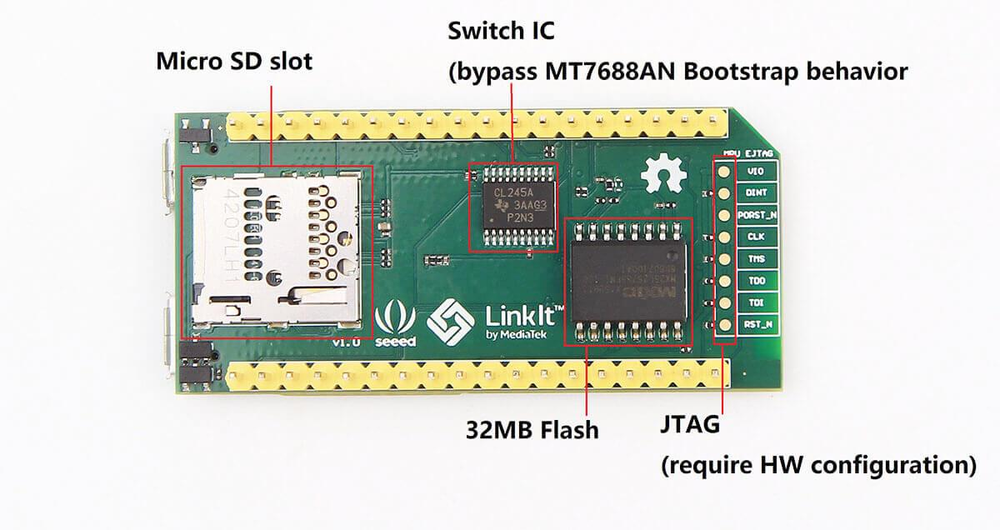
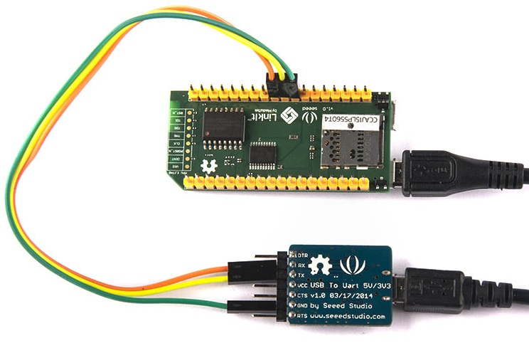

# LinkIt Smart 7688

## Detail Pictures




## Pinout Details

**[PDF Pinout Details](./linkit-smart-7688/7688.pdf)**

## Design Details

**[PDF Schematics](./linkit-smart-7688/Schematics-LinkIt-Smart-7688.pdf)**

**[PDF Layout](./linkit-smart-7688/Layout-LinkIt-Smart-7688-Layout.pdf)**

## Initial Steps in Configuring the Hardware

Though for most cases you can use the web interface on the `Recovery-Firmware`.

Its best to at least have the Serial Terminal interface also active.

1. Connect the [Serial Terminal](#steps-to-connect-the-serial-terminal)
2. Flashing [Recovery-Firmware](#flashing-the-recovery-firmware-firmware)
3. [Updating new firmware](#updating-new-firmware)
4. [New "OpenWrt 22.03.5" Firmware Setup](#new-openwrt-22035-firmware-setup)

After completing all the three of the above your **LinkIt Smart 7688** would be ready to use.

## Steps to Connect the Serial Terminal

!!! warning "3.3V Voltage Levels"

    This board operates on `3.3V` hence we need a **3.3V TTL UART Transceiver**

1. Connect the Device *Serial Port* to a **3.3V TTL UART Transceiver**

    ```mermaid
    graph LR;
        A[GND Pin] --> B[GND];
        c[P9 / RX2 Pin] --> d[TXD];
        e[P8 / TX2 Pin] --> f[RXD];
    ```

2. Open serial terminal over the correct port with **baud rate `57600`**

Picture Describing the Serial Port Connection:



## Start WiFi in OpenWrt

This one would work with all firmware.

```sh
uci show wireless
uci set wireless.radio0.country='IN'
uci set wireless.radio0.disabled=0
/etc/init.d/network restart
```

## [Flashing the Recovery-Firmware Firmware](./recovery-firmware-linkit.md)

Also you would need to have the [`Recovery-Firmware` flashed](./recovery-firmware-linkit.md).

This Video guide would help:

- MediaTek LinkIt Smart 7688 tutorial. Firmware upgrade with USB

    <https://www.youtube.com/watch?v=FFPtL2ZKKD8>

- Firmware upgrade by USB drive for LinkIt Smart 7688

    <https://www.youtube.com/watch?v=YZ1Zkg7vBqQ>

- Firmware file [`lks7688.img` from `RecoveryFirmware-LinkIt_Smart_7688_Firmware_v0.9.3.zip`](./recovery-firmware-linkit/LinkIt_Smart_7688_Firmware_v0.9.3.zip)

    Copy this file to the freshly formatted USB Disk.

- More details [here](./recovery-firmware-linkit.md).

## Updating New Firmware

1. Set the good **Root Password** for security

    ```sh
    passwd
    ```

2. Check the WiFi network

    ```sh
    uci show wireless
    ```

    This would display all wireless settings.

3. Set the Encryption on WiFi interface

    ```sh
    uci set wireless.ap.encryption='psk'
    uci set wireless.ap.key='password'
    uci commit wireless
    reboot
    ```

    This would reboot the module and set a security with above password.

    Its better this way since the recovery firmware does not protect the the network at all.

4. After this Join the secure network: `LinkIt_Smart_7688_XXXX`

5. In a browser visit:  <http://mylinkit.local>  Go to *OpenWrt for Advance....*

6. Use the same **Root Password** you sent earlier before the reboot.

7. Go to the `System Tab => In System - Back/Flash Firmware Tab`

8. Under *Flash New Firmware section* select the latest **OpenWrt firmware**
    using the *Open dialog box*.

    Use the new **[`OpenWrt 22.03.5 Firmware file`](./linkit-smart-7688/openwrt-22.03.5-ramips-mt76x8-mediatek_linkit-smart-7688-squashfs-sysupgrade.bin)**

    No Renaming needed as it can be directly uploaded here.

    Finally *click* on **Flash image**.

9.  It would then show the hash and size. *Click* on the **Proceed** button.

10. Wait for the WiFi like to come one fully. Typically this takes
    *approx 2-3 minutes*.

    So keep watching the serial console.

11. Once you get the message:

    `device eth0 entered promiscuous mode`

    System is ready. Press enter to get the new OpenWrt install.

    `OpenWrt 22.03.5, r20134-5f15225c1e`

12. This is the Latest firmware and has some different rules.

## New "OpenWrt 22.03.5" Firmware Setup

1. Make sure that the serial monitor console is working.

2. First lets look at the current WiFi Network configuration

    ```sh
    uci show wireless
    ```

3. We need to set the WiFi Country Correctly

    ```sh
    uci set wireless.radio0.country='IN'
    uci commit wireless
    reboot
    ```

    Strangely some times this does not work or the AP never shows up.

4. We enable the `radio1` also just in case :

    ```sh
    uci set wireless.default_radio1.encryption='psk'
    uci set wireless.default_radio1.key='password'
    uci set wireless.radio1.disabled='0'
    uci commit wireless
    reboot
    ```

    Here we are setting password for the AP `OpenWrt`.

    This should enable the *secondary radio* into **AP mode**.

    Not sure why there are 2 devices since this only supports a single one.

    You should get a new message:

    `device wlan0 entered promiscuous mode`

    and

    `IPv6: ADDRCONF(NETDEV_CHANGE): br-lan: link becomes ready`

    This means that the WiFi is working successfully.

5. After this you can join the `OpenWrt` AP with the *password set above*.

6. Type in the browser and visit <http://mylinkit.local>

    This might not work as in new version `Avahi` is disabled or not available by default.

    So visit  <http://192.168.100.1> instead.

    You can find IP again using `ifconfig` command.

    Click on the *LuCI interface link*.

7. Use the same **Root Password** we set in earlier steps.

8. You would be logged into the **LuCI console** of **OpenWrt**.

    Take care to upgrade your WiFi configuration and other security needs.
    Any changes to WiFi needs at least a minute to finalize and reboot.

9. You might have to *Forget the older network* and *Join Again* on the Host PC - when security changes.

    Use the **Radio1** Since that works in **OpenWrt 22.03.5** Firmware:

      - Its called ***OpenWrt 22.03.5 Firmware*** here.
      - Use **Scan** to add a client network on **Radio1*.
      - This would Form a *Bridge* between the *OpenWrt network* and the *your local Internet router*.
      - Go to `Network -> Interfaces` perform the **Bridge migration**.

        It would ask for a few migration of bridge interfaces.

      - Finally go to the `System Tab -> Software Tab` and

        Click on `Update lists....` Button.

        This would bring down the packages and update the software list.

10. After all this configuration you should have **2** network *WiFi interfaces*.

    - Your own *Local internet Router* connected to **LinkIt Smart 7688** and
      the **OpenWrt router AP** we configured earlier.
    - This way we have *mini router kind of device ready*.

## [Expanding the Memory](./expand-memory-linkit.md) on LinkIt Smart 7688

More on this described [here](./expand-memory-linkit.md).

## Sending files to MT7688 running OpenWrt via Network

We can easily transfer to our desired MT7688 using the `scp` command:

`scp HariAum root@mylinkit.local:~`

This would send the file to `/root/HariAum`.

!!! note "IP Address or `Avahi`"
    If the `mylinkit.local` does not work then use `ifconfig`
    command on *Serial Console* to find its IP Address.

## [Writing Golang programs](./golang-linkit.md) to run on LinkIt Smart 7688

More on this described [here](./golang-linkit.md).

----
<!-- Footer Begins Here -->
## Links

- [Back to OpenWrt and MT7688 Hub](./README.md)
- [Back to Linux Hub](../README.md)
- [Back to Root Document](../../README.md)