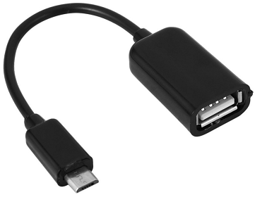

# Recovery-Firmware on LinkIt Smart 7688 Module

Essentially to recovery the board to a normal state we would need to *Downgrade* the firmware.

This special recovery firmware is the original :

`LinkIt_Smart_7688_Firmware_v0.9.3.zip` Firmware file = `lks7688.img`.

Its available [here](./recovery-firmware-linkit/LinkIt_Smart_7688_Firmware_v0.9.3.zip) locally.

This firmware would restore the MT7688 board back to original state.

There are 2 different ways of recovery :

1. [USB Boot recovery](#usb-boot-recovery-method-works-with-old-firmware) - using the bootloader entry
2. [Serial Port recovery](#serial-port-based-recovery) - using the `stty` terminal via **Serial port**.

## Common Steps

1. Ensure that the board is powered up reliably
2. Copy the `lks7688.img` from

    [`LinkIt_Smart_7688_Firmware_v0.9.3.zip`](./recovery-firmware-linkit/LinkIt_Smart_7688_Firmware_v0.9.3.zip)

    into a blank formatted **FAT32 USB Stick** root.

    Means not inside any directory.

    It needs to be directly available when we plug in the drive and open.

3. Connect the Device *Serial Port* to a **3.3V TTL UART Transceiver**

    ```mermaid
    graph LR;
        A[GND Pin] --> B[GND];
        c[P9 / RX2 Pin] --> d[TXD];
        e[P8 / TX2 Pin] --> f[RXD];
    ```

4. Open serial terminal over the correct port with **baud rate `57600`**.
5. Make sure that you get the *OpenWRT prompt* after connecting Serial terminal.
6. Connect the **USB Stick** the **HOST USB port** of **Linkit Smart 7688** using an **USB-B-Micro to USB-A** adapter.

    

## USB Boot recovery Method (Works with Old Firmware)

This method is also part of the Support-Videos :

- MediaTek LinkIt Smart 7688 tutorial. Firmware upgrade with USB

    <https://www.youtube.com/watch?v=FFPtL2ZKKD8>

- Firmware upgrade by USB drive for LinkIt Smart 7688

    <https://www.youtube.com/watch?v=YZ1Zkg7vBqQ>


Here are Steps documented :

1. Make sure all the [Common Steps](#common-steps) are followed
2. Hold the **WiFi button** for `2 seconds`
3. Keep the **WiFi button** held and press the **MPU button** momentarily.

    Means that after pressing the **MPU button** immediately release it.

    But keep the **WiFi button** held still.

4. Keep holding the **WiFi button** until the Orange Wifi LED turns On.

5. After the LED turn off release the WiFi key

6. It would start blinking very fast - Means the Firmware burning is in progress. This takes approximately `30 seconds`.

7. Then it would blinks slowly for some more time approx **3 Minutes+ !!**

    So wait patiently.

8. LED would turn *Off* for few seconds means it is booting.

9. Finally after a wait of approximately `30 seconds` the board would boot.

10. You will get both **WiFi access Point** `"Linkit_Smart_7688_XXXX"` and Serial port.

    Press Enter in the Serial terminal you should get the following
	OpenWrt version

    `CHAOS CALMER (15.05.1, r48749)`

## Serial Port based recovery

Reference: <https://forum.openwrt.org/t/linkit-smart-7688-wifi-not-working/37564/5>

Here are the steps:

1. Make sure all the [Common Steps](#common-steps) are followed.
2. In the serial terminal keep pressed the **5 key**
3. Press the **MPU button** on the Module and release it immediately

    This would reset the MT7688.

4. Keep looking at the Serial monitor screen till it begins showing

    `.....................` sort of lines.

    Immediately release the **5 key** on your keyboard.

5. Wait till all dots show up. It takes *more time than the USB direct method*.

    Approximately **5 Minutes+ !!** so wait patiently.

6. You would start seeing the **UBOOT messages** once the job is done.
7. Once you get the message like
`jffs2: notice: (1777) jffs2_build_xattr_subsystem: complete building xattr subsystem`

    Then you are done.

8. Press Enter to get the Prompt for OpenWrt on Serial Terminal

----
<!-- Footer Begins Here -->
## Links

- [Back to main LinkIt Article](./linkit-smart-7688.md)
- [Back to OpenWrt and MT7688 Hub](./README.md)
- [Back to Linux Hub](../README.md)
- [Back to Root Document](../../README.md)
