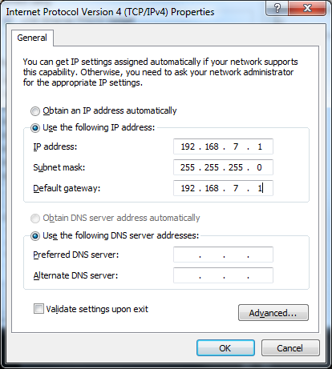

# Raspberry Pi Hub

All about Raspberry Pi and related documentation.

## Topics

- **[Raspberry Pi Model Differences](#raspberry-pi-model-differences)** - Various Models and Processors.
- **[Raspberry Pi Serial Number](#finding-serial-number-processor-info--model-of-raspberry-pi)** - Easy way to uniquely identify your Pi.
- **[Flashing OS using `rufus` tool](#flashing-raspberry-pi-os-images-using-rufus)** - Windows new flashing method with `rufus`.
- **[Pi-Hole DNS](./pi-hole.md)** - Help document for Installation and configuration of local Ad-blocking DNS.
- **[`mosquitto`](./mosquitto.md)** - Most popular MQTT Broker.
- **[Remove and Disable Bluetooth](./remove-bluetooth.md)** - Help with getting rid of bluetooth for security.
- **[Nodejs](./nodejs.md)** - Installing NodeJs in Raspberry Pi.
    - **[`node-red`](./node-red.md)** - The IoT Control logic done Visually.
- **[Unattended upgrades](./unattended-upgrades.md)** - Automatic updates for Linux systems running 24/7.
- **[Log2Ram](./log2ram.md)** - Save the SD Card by logging to RAM instead.
    - **[Raspberry Pi Log2Ram issue](./log2ram-issue.md)** - Fixing the error 1071.
- **[`influxdb`](./influxdb.md)** - The famous Time Series database for IoT.
- **[`Grafana`](./grafana.md)** - Data visualization frontend - goes well with [`influxdb`](./influxdb.md).
- **[OctoPrint](./octoprint.md)** - 3D Printer Control Interface.
- **[SSH Server `sshd`](./ssh-server.md)** - Essential tools for working with Raspberry Pi remotely.
- **[`fail2ban`](#securing-raspberry-pi-ssh-using-fail2ban-security)** - Secure Pi from Brute force or DDOS on SSH etc.
- **[Static IP Configuration for Raspberry Pi](./static-ip.md)** - Network configuration.
- **[USB over IP](./network-usb-hub.md)** - Using Raspberry Pi as a Networked USB Hub.
- **[Wireless USB Keyboard using Raspberry Pi Zero W](./zerow-hid.md)** - HID Keyboard over WiFi using Raspberry Pi Zero W USB port.
- **[`ufw`](#ufw-firewall-in-raspberry-pi)** - Firewall for Raspberry Pi.
- **[Headless Setup of Raspberry Pi](#raspberry-pi-headless-configurations)** - Some times monitor and keyboards are not needed.
- **[Add Raspberry Pi Package Repository Mirrors](#add-raspberry-pi-mirrors)** - Fix the issues with non-working local mirrors.
- **[Fix Broken Packages](#fix-a-broken-package-install-in-raspberry-pi)** - Avoid or fix errors during package installs.

## Others

- **Pi VPN**
    - Initial setup <https://www.youtube.com/watch?v=am55fi_Czl8>
    - Full setup <https://www.youtube.com/watch?v=5NJ6V8i1Xd8>
- `motion` Video Output
    - Repository : <https://github.com/Motion-Project/motion>
    - <https://www.instructables.com/How-to-Make-Raspberry-Pi-Webcam-Server-and-Stream-/>
    - <https://pimylifeup.com/raspberry-pi-webcam-server/>
- **[`DNSmasq` based DNS Server](./dnsmasq.md)** - Another DNS server for Raspberry Pi.
- [EMQX](./emqx.md) - Chinese MQTT Broker - **Use it at your own risk !!**

## Raspberry Pi Model Differences

Here is a **[PDF document](./README/raspberrypi-models.pdf)**.

Got this from : <https://raspberrytips.com/start-here/>

## Finding Serial Number, Processor info & Model of Raspberry Pi

In order to obtain the full information about a give Raspberry Pi
one can poke the `cpuinfo` from `/proc`

```bash
cat /proc/cpuinfo
# This would generate Output:
# ...
# Hardware	: BCM2835
# Revision	: 9020e0
# Serial	: 00000000abcdefab
# Model	: Raspberry Pi 3 Model A Plus Rev 1.0
```

This would print the total number of **CPU**, the **hardware variant**
and **Serial number**.

### Using the Raspberry Pi Serial number Info as a License

Now we can  generate a **Unique signature** for a given Raspberry Pi:

```bash
cat /proc/cpuinfo | sha256sum | cut -d ' ' -f 1
```

This command will generate the **SHA256** of the *complete system info* and would be a **unique hash** for particular Raspberry Pi.

This can be used to specifically identify a given raspberry pi.
**Or as Serial number for Software**.

## Flashing Raspberry Pi OS images using [`rufus`](https://github.com/pbatard/rufus)

Reference : <https://www.youtube.com/watch?v=YtXTREeZwv4>

- Open **[`rufus`](https://github.com/pbatard/rufus)** select the raw `.img` file
- Select the correct drive and then press start to begin writing.
- Its much easier than the older `Win32Diskimager`.

## Securing Raspberry Pi SSH using `fail2ban` Security

Reference:

- <https://pimylifeup.com/raspberry-pi-fail2ban/>
- <https://raspberrytips.com/install-fail2ban-raspberry-pi/>

### Installation & Configuration of `fail2ban` on Raspberry Pi

```sh
sudo apt install fail2ban
```

Jail Configuration :

```sh
sudo cp /etc/fail2ban/jail.conf /etc/fail2ban/jail.local
```

Edit Configuration:

```sh
sudo nano /etc/fail2ban/jail.local
```

Find the following in the file `jail.local`:

```sh
[sshd]

port    = ssh
logpath = %(sshd_log)s
backend = %(sshd_backend)s
```

Add the following below the `[sshd]`

```sh
enabled = true
filter = sshd
banaction = iptables-multiport
bantime = -1 # For permanant blocking
bantime = 1800 # this is the normal setting for 30 minutes block
maxretry = 5
```

Rearrange, then it should looks like this in `jail.local`:

```sh
[sshd]
enabled = true
filter = sshd
port = ssh
banaction = iptables-multiport
bantime = 1800
maxretry = 3
logpath = %(sshd_log)s
backend = %(sshd_backend)s
```

Save the file and restart the `fail2ban` service.

```sh
sudo service fail2ban restart
```

## Access Raspberry Pi GPIO from Golang

<https://github.com/stianeikeland/go-rpio>

## Fixing the Raspberry Pi SD Card wear issues

Links:

- Read-only-filesystem Main <https://k3a.me/how-to-make-raspberrypi-truly-read-only-reliable-and-trouble-free/>
- Read-only-filesystem <http://hallard.me/raspberry-pi-read-only/>
- <https://mcuoneclipse.com/2019/04/01/log2ram-extending-sd-card-lifetime-for-raspberry-pi-lorawan-gateway/>
- <https://wizworks.net/reduce-or-eliminate-sd-card-corruption-on-raspberry-pi/>
- <https://domoticproject.com/extending-life-raspberry-pi-sd-card/>
- <https://raspberrypi.stackexchange.com/questions/62533/how-can-i-reduce-the-writing-to-log-files>
- <https://ideaheap.com/2013/07/stopping-sd-card-corruption-on-a-raspberry-pi/>
- <https://blog.nunosenica.com/reduce-write-operations-to-sd-card-with-raspbian/>

## Raspberry Pi read-only Filesystem

- <https://medium.com/swlh/make-your-raspberry-pi-file-system-read-only-raspbian-buster-c558694de79>
- <https://www.raspberry-pi-geek.de/ausgaben/rpg/2018/08/raspbian-im-read-only-modus/2/>

## Raspberry Pi Zero-W as USB-Ethernet Device

**Not Working as of 2023-06-06 20:58.13-364**

Reference:
- <https://learn.adafruit.com/turning-your-raspberry-pi-zero-into-a-usb-gadget/ethernet-gadget>

!!! bug "Not Working **2023-06-06 20:58.13-364**"
    This actually does not work out correctly.

Here are the Steps:

- Along with the [other headless section](#raspberry-pi-headless-configurations) steps we need to do a few additional steps.
- In the file `config.txt` inside the `boot` FAT32 Partition
    - Add line `dtoverlay=dwc2`. This would enable the Ethernet device.
    - Add this at the end.
- In the file `cmdline.txt` inside the `boot` FAT32 Partition -
    after `rootwait` word insert `modules-load=dwc2,g_ether`.
    - Earlier it was : `modules-load=dwc2,g_ether,g_serial`

Final line should look like:

```sh
dwc_otg.lpm_enable=0 console=serial0,115200 console=tty1 root=/dev/mmcblk0p2 rootfstype=ext4 elevator=deadline fsck.repair=yes rootwait modules-load=dwc2,g_ether quiet init=/usr/lib/raspi-config/init_resize.sh
```
- Now Connect the Raspberry with the USB-B-Mini socket marked as `USB` and `not PWR`.
- This would show in the system as an Ethernet device as well as enable Serial access.

### Advanced Networking Fix the IP Address for USB interface

You would find a **usb0** interface using the command :

```sh
sudo ifconfig -a
```

Edit and add the following to `network/interfaces` using command:

```sh
sudo nano /etc/network/interfaces
```

Here is how the file should have the contents:

```sh
allow-hotplug usb0
iface usb0 inet static
        address 192.168.7.2
        netmask 255.255.255.0
        network 192.168.7.0
        broadcast 192.168.7.255
        gateway 192.168.7.1
```

Save and restart the interface:

```sh
sudo ifdown usb0 # (this may fail, its fine)
sudo ifup usb0
ifconfig usb0
```

Next setup the network in Windows side as well:

Enter in **192.168.7.1** as the computer's IP address and gateway (the gateway got erased later. Windows just automatically uses the IP address if they're the same) the subnet mask is **255.255.255.0** same as the Pi's.



This would make a secondary network available that would help to connect
directly to the Raspberry Pi and without even external network connected.

!!! note "**IMPORTANT**"
    Make sure to use the same USB Port as you used for setup in Windows. Else the configuration would be lost.

## Raspberry Pi `HomeAssistant` Install Steps

Reference:

- Home Assistant Step-by-step Installation Guide on Raspberry Pi

    <https://www.youtube.com/watch?v=dZFHyvY2Gp8>

- Full Article: <https://raspberrytips.com/home-assistant-raspberry-pi/>
- Official Install Help: <https://www.home-assistant.io/installation/raspberrypi>

There are basically 2 methods one can install Home Assistant:

1. Directly using the provided image
2. Installing it Manually using docker

First we would need to *install docker*:

```bash
curl -sSL https://get.docker.com | tee docker-install.sh
sh ./docker-install.sh
```

Next We need to open the port on firewall:

```bash
sudo ufw allow 8123
```

Finally running the docker instance:

```bash
docker run -d \
    --name homeassistant \
    --privileged \
    --restart=unless-stopped \
    -e TZ=Asia/Kolkata \
    -v /PATH_TO_YOUR_CONFIG:/config \
    --network=host \
    ghcr.io/home-assistant/home-assistant:stable
```

## USB Boot on Raspberry Pi 3 and Newer models

Reference:

<https://www.howtoraspberry.com/2022/03/how-i-got-my-old-pi-3-to-boot-from-usb/>

Raspberry Pi has an **One Time Programmable Memory(OTP)**.

This contains a **bit** to enable the __**USB Boot Mode**__.

In order to enable this we need first modify the `/boot/config.txt`` file
and boot the Raspberry Pi once:

```bash
  echo program_usb_boot_mode=1 | sudo tee -a /boot/config.txt
```

This code adds the like `program_usb_boot_mode=1` at the end of
the `/boot/config.txt` file.

After this one needs to reboot the Raspberry Pi once.

To verify if the modification was successful one needs to check the following:

```sh
  vcgencmd otp_dump | grep 17
  # This would output as follow:
  # 17:3020000a
```

If the output contains the value `3020000a` we are all set.

Now we can remove the SD card. And use a USB drive to boot.

!!! note "**SD Card Priority**"
    If the **SD card** and the **USB** are connected then the **SD card takes priority**.

## `ufw` Firewall in Raspberry Pi

`ufw`= Uncomplicated Firewall for Raspberry Pi.

Reference:

- <https://pimylifeup.com/raspberry-pi-ufw/>
- <https://christitus.com/linux-security-mistakes/>

First we need to Install the `ufw` package:

```bash
sudo apt install ufw
```

Next, We need to add the firewall Rules:

```bash
sudo ufw limit 22/tcp comment "SSH"         # For Limiting use of more connection attempts
sudo ufw allow 443/tcp comment "HTTPS"      # HTTPS
sudo ufw allow 80/tcp  comment "http"       # HTTP
sudo ufw allow 5353 comment "avahi"         # avahi Discovery port
sudo ufw allow 7575 comment "VirtualHere"   # For VirtualHere USB service
sudo ufw default deny incoming
sudo ufw default allow outgoing
sudo ufw enable
```

To check the Status of the firewall:

```bash
sudo ufw status
sudo ufw status numbered # Even Better with numbered list of rules
```

To Enable the firewall and make sure it gets loaded at Boot:

```bash
sudo systemctl enable --now ufw.service
```

Finally some useful aliases that can help:

```bash
alias firewall='sudo ufw status numbered'
alias ufw-allow='sudo ufw allow'
alias ufw-limit='sudo ufw limit'
```

## Creating a New User in Raspberry Pi

Its a good idea to get rid of the =pi= user that comes default with the **Old Raspbian OS**. In the Latest version this is already done. Lets look at how do we proceed.

Create a New User `ab` :

```bash
# Create the User
sudo adduser ab
# Add user to the Groups
sudo usermod -a -G adm,dialout,cdrom,sudo,audio,video,\
   plugdev,games,users,input,netdev,gpio,i2c,spi ab
# Set User Password
sudo passwd ab
# Give Sudo Permission
echo "ab ALL=(ALL) PASSWD: ALL" | sudo tee /etc/sudoers.d/010_ab
```

Removing the Old `pi` user:

```bash
  sudo deluser -remove-home pi
```

!!! note "SSH Access"
    Before doing this at least login using the created user.
    Also install the *SSH Keys* into the current user for accessing remotely.

## Reading Raspberry Pi CPU / GPU temperature in Terminal mode

Reference:

- CPU Temperature <https://www.cyberciti.biz/faq/linux-find-out-raspberry-pi-gpu-and-arm-cpu-temperature-command/>
- GPU Temperature <https://pimylifeup.com/raspberry-pi-temperature/>

### CPU Temperature of Raspberry Pi

```bash
cat /sys/class/thermal/thermal_zone0/temp
```

This would be directly a **1000 times of the actual value**.
Hence we need to *divide it*.

```bash
cpu=$(</sys/class/thermal/thermal_zone0/temp) && echo "$((cpu/1000))'C"
```

### GPU Temperature of Raspberry Pi

!!! bug "Change in GPU"
    This is not working anymore.

```bash
/opt/vc/bin/vcgencmd measure_temp
# Should be some thing like this:
# temp=42.0'C
```

This should show the #GPU temperature in degrees centigrade.

### Useful alias for Temperature

Some useful Bash Aliases for these:

```bash
alias gputemp='/opt/vc/bin/vcgencmd measure_temp'
alias cputemp='cpu=$(</sys/class/thermal/thermal_zone0/temp) && echo "$((cpu/1000))'C"'
# These Would create the Aliases
echo "alias gputemp='/opt/vc/bin/vcgencmd measure_temp'">> ~/.bash_aliases
echo "alias cputemp='cpu=\$(</sys/class/thermal/thermal_zone0/temp) && echo \"\$((cpu/1000))'C\"'" >> ~/.bash_aliases
```

This would add the `temp` alias to the `.bash_aliases` file.
Upon next logon the Raspberry Pi would automatically load this.

## Raspberry Pi Headless configurations

Steps:

- **2022** Working Configuration for now - [Document Here](./headless-config-2022.md)
- **2023** Attempt that **failed** - ~~[Document Here](./headless-config-new-2023.md)~~
- [Older Method](./headless-config-old.md)

References:

- <https://www.declarativesystems.com/2022/06/23/headless-rasperry-pi-setup.html>

### Fixes for Debian 12 `bookworm` Issues

Yes the latest version as of `2023-11-18 Sat 08:36.17`
does not work even with the 2022 configuration.

This is due to following issue:

<https://github.com/RPi-Distro/raspberrypi-net-mods/issues/11>

The Solution can be found here:

<https://forums.raspberrypi.com/viewtopic.php?t=357562>

The solution suggested is create a file in `rootfs` called : 

`/etc/NetworkManager/system-connections/your-wifi-ssid.nmconnection` 

This needs the `chmod 600` permission and user as `root:root`.

Contents:

```
[connection]
id=your-wifi-ssid
uuid=xxxxxxxx-xxxx-xxxx-xxxx-xxxxxxxxxxxx
type=wifi
interface-name=wlan0

[wifi]
mode=infrastructure
ssid=your-wifi-ssid

[wifi-security]
auth-alg=open
key-mgmt=wpa-psk
psk=your-wifi-psk (64 hex digits or plaintext)

[ipv4]
method=auto

[ipv6]
addr-gen-mode=default
method=auto

[proxy]
```
Replace the `your-wifi-ssid` with correct SSID info.
Also `psk=your-wifi-psk (64 hex digits or plaintext)` needs to corrected. Don't worry about spaces or special characters in your password, it would work.

```sh
cd /etc/NetworkManager/system-connections
sudo chmod 600 ./your-wifi-ssid.nmconnection
sudo chown -R root:root ./your-wifi-ssid.nmconnection
```

You can also copy your own Linux PC `.nmconnection` files:

```sh
cd "/media/${USER}/rootfs/etc/NetworkManager/system-connections"
sudo cp /etc/NetworkManager/system-connections/*.nmconnection .
```

### Change Mount point of `bootfs` in Debian 12 `bookworm`

It usually was the `/boot` directory that contained all
the `bootfs` files of the Raspberry Pi SD Card.

However as of **Debian 12** this has changed to `/boot/firmware`.

This means that the `rootfs` has the `/boot` directory and the `bootfs` is mounted to `/boot/firmware`.

Must take care of this nonce while adding scripts or files into the `bootfs` that might be needed later for configuration.

## Add Raspberry Pi Mirrors

This might be needed in case you find some of your own mirrors or local mirrors to be not accessible.

Visit the site : https://www.raspbian.org/RaspbianMirrors

This lists out all possible mirrors of the Raspbian distribution available.

You would need to edit the configuration for `apt`:

```sh
sudo nano /etc/apt/sources.list
```

!!! warning "Debian Version"
    The commands here use `bullseye` this might change in the future and needs to be accordingly incorporated.

It would contain by default :

```sh
deb http://raspbian.raspberrypi.org/raspbian/ bullseye main contrib non-free rpi
```

We need to replay the above URL with a new Mirror Like :

```sh
deb https://ftp.kaist.ac.kr/raspbian/raspbian/ bullseye main contrib non-free rpi
```

Then we can do the generic update fix the the install.

!!! note "Protocol"
    Both `http` and `https` are supported by default. So its recommended to switch to `https`.

## Fix a Broken package Install in Raspberry Pi

Here are few steps that can help to Fix a Broken Install :

```sh
# This would fix the missing packages for mosquitto installation
sudo apt install mosquitto --fix-missing

# This would fix incase something broke down while installing
sudo apt install --fix-broken
```

## Raspberry Pi IoT Packages

- More details about MQTT 2.0 in video <https://www.youtube.com/watch?v=IiQdW1pjOEw>
- Raspberry Pi Combo : NodeRed + MQTT + InfluxDB + Grafana install <https://www.superhouse.tv/41-datalogging-with-mqtt-node-red-influxdb-and-grafana/>


## Convert Raspberry Pi to Access Point over Ethernet

<https://thepi.io/how-to-use-your-raspberry-pi-as-a-wireless-access-point/>


## Raspberry Pi 400 as USB PC Keyboard Peripheral

Using Raspberry Pi 400 keyboard PC as a USB keyboard for your PC.

!!! warning "Not looking good"
    This is an **highly experimental** piece of software and the total load
    of running the full RP400 through one USB port might be too great
    if you are not running off a well fed PC.

References:

- CNX Software - Using Raspberry Pi 400 keyboard PC as a USB keyboard for your PC

    <https://www.cnx-software.com/2021/10/14/using-raspberry-pi-400-keyboard-pc-as-a-usb-keyboard-for-your-pc/>

- `pi400kb` Project Repository <https://github.com/Gadgetoid/pi400kb>

    Raw HID keyboard forwarder to turn the Pi 400 into a USB keyboard

    **[Repository](./README/pi400kb-main.zip)** Locally - just in case.

----
<!-- Footer Begins Here -->
## Links

- [Back to Linux Hub](../README.md)
- [Back to Root Document](../../README.md)
