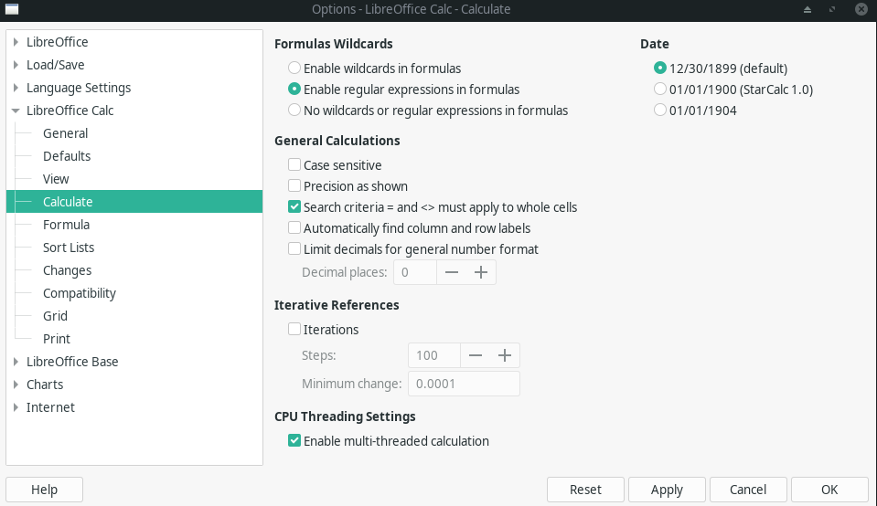

# LibreOffice

Free Microsoft office alternative on Linux and other platforms.

## LibreOffice Calc - How to do Partial Match Query ?

Reference : <https://ask.libreoffice.org/t/partial-match-query/62114>

**[PDF document](./libreoffice/Partial-match-query-English-Ask-LibreOffice.pdf)**

```excel
=MATCH(".*"&A1&".*",$B$1:$B$10000,0)
```

The use of `".*"` adds regular expression syntax.

Please make sure **Enable regular expressions in formulas** is set correctly, not **Enable wildcards in formulas** in `Tools -> Options -> LibreOffice Calc -> Calculate`.

Here is how it should look like:



----
<!-- Footer Begins Here -->
## Links

- [Back to Linux Hub](./README.md)
- [Back to Root Document](../README.md)

