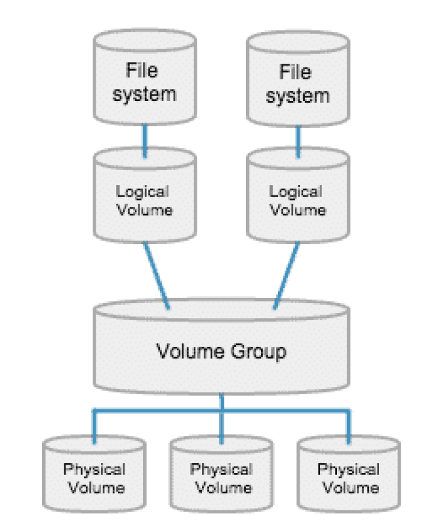
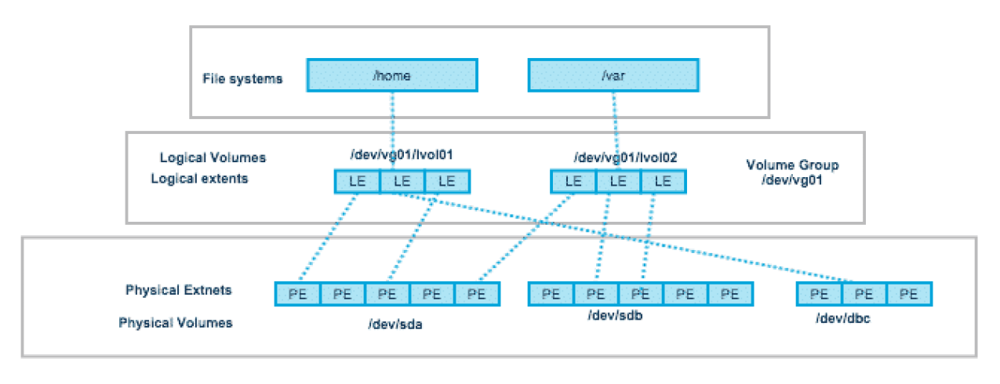

# LVM - Linux Logical Volume Manager

Primary intro Reference:

- Linux Logical Volume Manager (LVM) Deep Dive Tutorial

    <https://www.youtube.com/watch?v=MeltFN-bXrQ>

- Companion Web Page

    <https://www.learnlinux.tv/linux-logical-volume-manager-lvm-deep-dive-tutorial/>

- **[PDF](./lvm/learnlinux.tv-LVM-Deep-Dive-Tutorial.pdf)** Copy locally.

Another Great resource:

- Beginner’s Guide to LVM (Logical Volume Management)

    <https://www.thegeekdiary.com/redhat-centos-a-beginners-guide-to-lvm-logical-volume-manager/>

- **[PDF](./lvm/thegeekdiary.com-Beginners-Guide-to-LVM.pdf)** Copy locally.

## Picture Explaining the Way of LVM



Actual Layout:



Both Pictures are credited to <https://www.thegeekdiary.com/>.

## Important Commands and Snippets for LVM

### Extend the logical volume under LVM

```sh
lvextend --resizefs -l +100%FREE /dev/mapper/vg_ubuntu-lv_root
```

This would resize the **Logical Volume** `lv_root` under the
**Volume group** `vg_ubuntu` to take up the full space `+100%FREE` available.

Another way only give `10GiB` to the `lv_root`:

```sh
lvextend -L +10G /dev/mapper/vg_ubuntu-lv_root
# Expand the Filesystem
resize2fs /dev/mapper/vg_ubuntu-lv_root
```

Using the `--resizefs` on can do the above in a single command.

### Convert a disk to an LVM physical volume

```sh
pvcreate /dev/sdb
```

Make sure that the `/dev/sdb` actually is your disk or change it accordingly.
The above would create a **Physical Volume** out of disk `/dev/sdb`.

```sh
vgextend vg_ubuntu /dev/sdb
```

This would add the the **Physical Volume** in `/dev/sdb` into
the **Volume group** `vg_ubuntu`.

```sh
vgdisplay
```

This would display the *structure* of the **LVM setup**.

## Creating a brand-new LVM setup

Convert the new disk to be an LVM physical volume:

```sh
pvcreate /dev/sdc
```

Make sure that the `/dev/sdc` actually is your disk or change it accordingly.

Create the *volume group* :

```sh
vgcreate vg_extra /dev/sdc
```

Check the *volume group* :

```sh
vgdisplay
```

Create a logical volume (named `lv_logs` in this example):

```sh
lvcreate vg_extra -L 5G -n lv_logs
```

Format the logical volume :

```sh
mkfs.ext4 /dev/mapper/vg_extra-lv_logs
```

!!! info "Path Format for **Volume Group** and **Logical Volume**"

    `/dev/mapper/vg_extra-lv_logs`

    Here the **Volume Group** is `vg_extra`.

    And, **Logical Volume** is `lv_logs`.

Create a directory to mount the new *logical volume* :

```sh
mkdir /mnt/extra/logs
```

Mount the logical volume:

```sh
mount /dev/mapper/vg_extra-lv_logs /mnt/extra/logs
```

Find the `block id` of the new logical volume:

```sh
blkid /dev/mapper/vg_extra-lv_logs
```

Back up your fstab file to be safe:

```sh
cp /etc/fstab /etc/fstab.bak
```

Edit the `fstab` file:

```sh
nano /etc/fstab
```

Add a line to the `fstab` to mount the volume, similar to this:

```sh
UUID=<BLOCK ID FOR LOGICAL VOLUME> /mnt/extra/logs ext4 defaults 0 2
```

Test the new mount, first making sure it’s not mounted:

```sh
umount /mnt/extra/logs

mount -a
```

## Creating and Managing Snapshots in LVM

Create a new snapshot:

```sh
lvcreate /dev/mapper/<SOURCE VOLUMEGROUP NAME> -L 1G -s -n snapshot_name
```

Replace `<SOURCE VOLUMEGROUP NAME>` and `snapshot_name` accordingly.

View used space of snapshots:

```sh
lvs
```

Mount a snapshot:

```sh
mount /dev/mapper/vg_extra-web_snapshot_20200421 /mnt/extra/snapshot
```

Restore a Snapshot:

```sh
# Umount the Logical Volume
umount /dev/mapper/vg_extra-lv_web
# Restore the Snapshot
lvconvert --merge /dev/mapper/snapshot_name
# Refresh
lvchange -an /dev/mapper/vg_extra-lv_web
lvchange -ay /dev/mapper/vg_extra-lv_web
```

## Reduce/Shrink the LVM Volume

<https://www.rootusers.com/lvm-resize-how-to-decrease-an-lvm-partition/>

1. First step is to **unmount** the target volume.

    Originally the **volume is assumed to be `15GiB`** in size.

    For shrinking a *root volume* :

    ```sh
    # Reboot into a Live Medium and issue the following
    vgchange -an /dev/mapper/<Your-Volume> # Disable
    ```

    Since reducing a *root volume* is not possible when the OS is booted.
    We would need to boot into a live medium OS to perform this.

    For all other Volumes:

    ```sh
    umount /dev/mapper/<Your-Volume>
    ```

2. Check the file system that was unmounted:

    ```sh
    e2fsck -fy /dev/mapper/<Your-Volume>
    ```

3. Shrink down the actual *Filesystem* in the **Logical Volume** :

    ```sh
    resize2fs /dev/mapper/<Your-Volume> 10G
    ```

    !!! warning "Size of Free Space in Partition"
        The state of the **Logical Volume** begin shrunk should be such that'
        *data content inside filesystem should be less than the desired size*.
        In the above case it should be less than `10GiB`.

4. There can be two types of Reduction/Shrinkage commands:

    a. To Reduce to `10GiB`:
    ```sh
    lvreduce -L 10G /dev/mapper/<Your-Volume>
    ```
    This means the size specified is the **absolute value** of Size.

    b. To Reduce by `5GiB` resulting in a `10GiB` volume size:
    ```sh
    lvreduce -L -5G /dev/mapper/<Your-Volume>
    ```
    This is taking away the free space in the volume by `5GiB`.

5. Fix the new Volume after resize:

    ```sh
    resize2fs /dev/mapper/<Your-Volume>
    ```

6. Re-enable the LVM and mount the partition back:

    ```sh
    vgchange -ay /dev/mapper/<Your-Volume>
    # In a CHroot environment try
    mount -a
    ```

----
<!-- Footer Begins Here -->
## Links

- [Back to Linux Hub](./README.md)
- [Back to Root Document](./README.md) Return to the Root