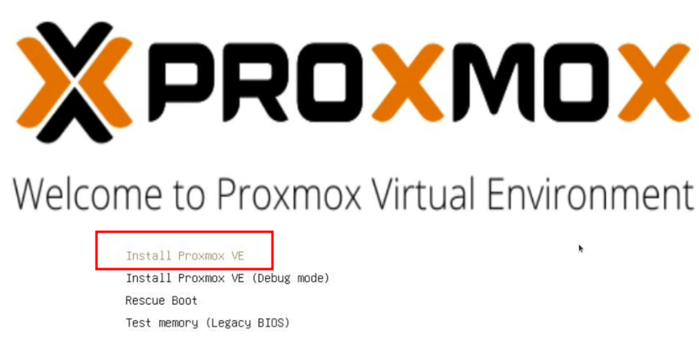
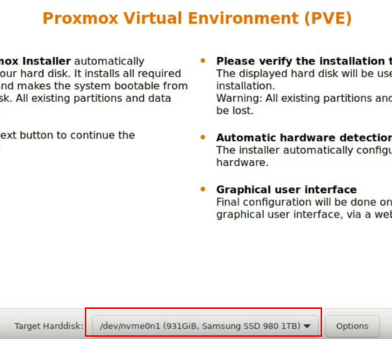
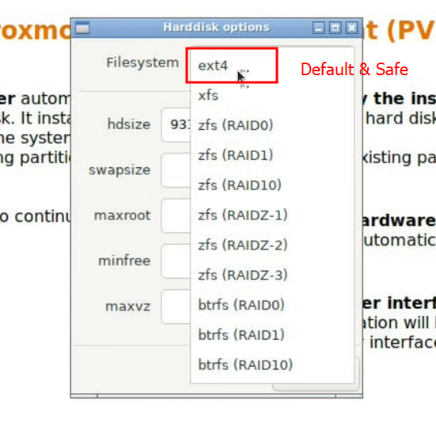
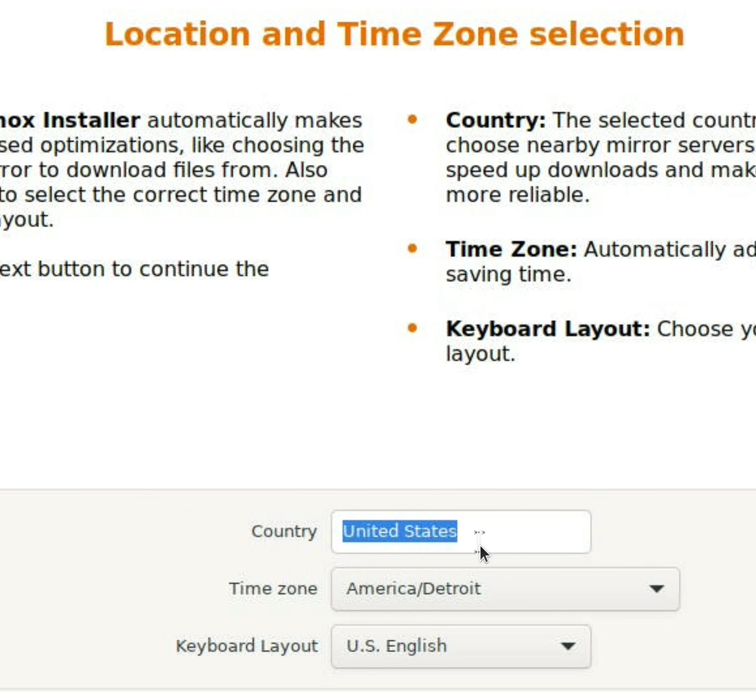
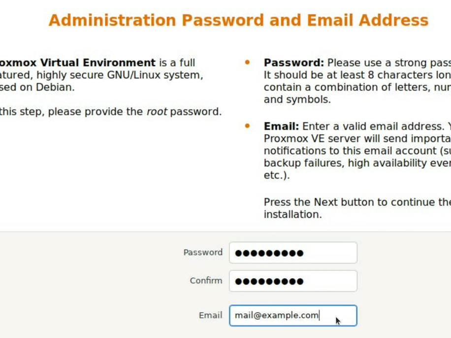
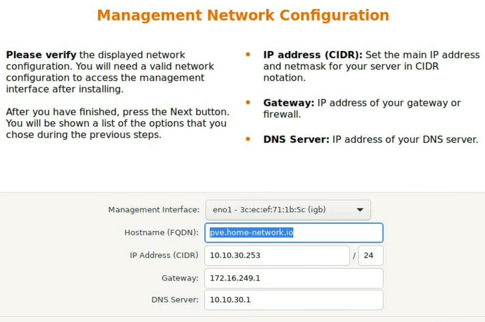

# Proxmox in Laptop

## Inspiration & Reference

It all started with these videos.

- [Turn Your Old Laptop Into a Perfect Proxmox Server](https://www.youtube.com/watch?v=EfIfoWAV_g8)
    - Youtube <https://www.youtube.com/watch?v=EfIfoWAV_g8>
    - Related Web Page <https://gateway-it.com/turn-your-old-laptop-into-perfect-proxmox-server/>
- [$100 Virtualization PC: How I'm Using Proxmox at Home](https://www.youtube.com/watch?v=191r_mWZ8qM)
    - Youtube <https://www.youtube.com/watch?v=191r_mWZ8qM>
- [How to Homelab - Laptops as Servers?!](https://www.youtube.com/watch?v=obdtUJECFWY)
    - Youtube <https://www.youtube.com/watch?v=obdtUJECFWY>

## Preparation for Laptop

- Format the laptop and wipe all partition and data, after backup as needed.
- Connect **Ethernet** Cable. *Yes, Proxmox will only work with Ethernet not WiFi*.
- Connect AC power Source for the Laptop
- Its always better to have **SSD as the installation drive** to keep things speedy.

## Install Image

Visit <https://www.proxmox.com/en/downloads>

**Proxmox Virtual Environment** or **Proxmox VE** *ISO* is what we are looking for.

As of `2023-07-21 09:42.33`:

> ### Proxmox VE 8.0 ISO Installer
> Updated on 22 June 2023
>
> #### Version: 8.0-2
> <https://www.proxmox.com/en/downloads/item/proxmox-ve-8-0-iso-installer>
> ```
> SHA256SUMS for the ISO
> e2b27648a8a91c0da1e8e718882a5ff87a8f054c4dd7e0ea1d8af85125d82812
> ```

## USB Install Media

Use **[Rufus](https://rufus.ie/en/)** or **[`ventoy`](https://www.ventoy.net/en/download.html)** to create a USB media to load.

Or latest one recommended **[`usbimager`](https://gitlab.com/bztsrc/usbimager)**.

Need at least **`2GB`** minimum capacity of the USB disk.

## Install Process

### Proxmox VE Full Course: Class 2 - Installation Process

Youtube Video 2

<https://www.youtube.com/watch?v=u8E3-Zy9NvI&list=PLT98CRl2KxKHnlbYhtABg6cF50bYa8Ulo&index=2>

### Steps

1. Make sure that boot on Laptop is setup to take the **Proxmox** drive to boot.

2. Select the *Install Proxmox VE* in the menu.

    ??? note "Proxmox Selection"
        

3. Agree to the **EULA**

4. Next, you would get the HDD Select screen.

    ??? note "Proxmox Install HDD selection Screen"
        

    There is also a possibility to select the special **ZFS** storage. Since it would help to enhance reliability but it takes lot of memory so se it as per your hardware configuration. And **EXT4** is default and works on most hardware.

    ??? note "Default and safe options"
        

5. We would need to select the correct *Time Zone* and keyboards next.

    ??? note "Set timezone and keyboard"
        

6. We would now need to set the password for `root` account.

    ??? note "Set the admin password and email"
        

    >**Note:** Set a proper hard password here. And remember to set the correct only if you would *purchase* support or license for **Proxmox** later.

7. Network interface settings come next.

    ??? note "Networking Settings"
        

    Make sure to select the correct network interface. It should be the **Ethernet** port you have connected the cable. Also here you would need **Static IP Address** so use some range where your router's **DHCP** is not handing out addresses. We can only specify one DNS to begin with but later we can add more from the web console.

8. Finally you would get a summary and press next to begin the install.

9.  After installing completes the system would request to reboot.

10. Allow it to reboot and let it start with normal startup.

11. Make sure to remove the USB drive used for the install.

You should now be able to access the Online console on port **`8006`**.

## Prevent laptop sleep when lid is closed

This is special case need for when Laptop is used as the Proxmox server.

Edit the file `/etc/systemd/logind.conf`:
```sh
vi /etc/systemd/logind.conf
```

**Note:** You may need to install `nano` in case you wish to use it. And no `sudo` needed since you are `root`.

Un-Comment the line: `HandleLidSwitch=suspend`

And change `suspend` to `ignore`.

Save the file and restart the service:

```sh
systemctl restart systemd-logind
## and
systemctl status systemd-logind
```

**Or** Just restart the PC.

## Testing repos for Proxmox

Without subscription the main Proxmox repos are not accessible.
However some test repositories are still open. These contain `beta` quality software.
By allowing them you can get latest unsafe version of the software available by subscription.

```sh
rm /etc/apt/sources.list.d/pve-enterprise.list
echo "## PVE ##" >> /etc/apt/sources.list
echo "deb http://download.proxmox.com/debian/pve bookworm pve-no-subscription" >> /etc/apt/sources.list
apt update
```

**This is very UNSAFE and do it at your own risk.**

You can also change this from the GUI.

## More laptop specific tuning

```sh
apt install -y tlp
echo "HandleLidSwitch=ignore" >> /etc/systemd/logind.conf
echo "HandleLidSwitchExternalPower=ignore" >> /etc/systemd/logind.conf
echo "HandleLidSwitchDocked=ignore" >> /etc/systemd/logind.conf

#### You can check your battery status with the next commands:

tlp-stat -s
tlp-stat -b

## finally Upgrade the system

apt -y dist-upgrade
reboot
```

----
<!-- Footer Begins Here -->
## Links

- [Back to Linux Hub](./README.md)
- [Back to Root Document](../README.md)
