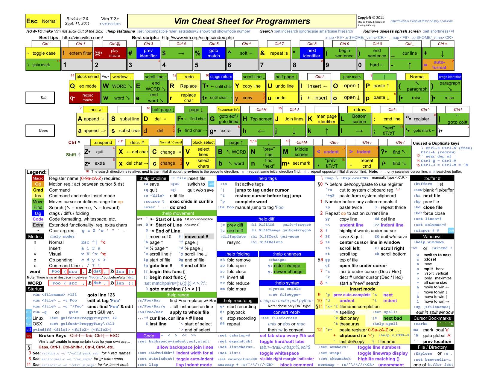

# `vim` Text Editor

## Website

<https://www.vim.org/>

## Vim Shortcuts Cheat sheet

<https://vim.rtorr.com/>

## Vim Tutorial Crash Course

<https://www.youtube.com/watch?v=IiwGbcd8S7I>

## How to Do 90% of What Plugins Do (With Just Vim)

<https://www.youtube.com/watch?v=XA2WjJbmmoM>

## Configuration file for Vim

Its typically stored in the home directory of the User.
`.vimrc` is the file.

### Vim Mappings - Life changing Key maps

Video <https://www.youtube.com/watch?v=I0PrxH53Rfc>

### Recommended `.vimrc`

In `~/.vimrc` Add the following:
```vimrc
" Save some Key Strokes on the Leader key
"  by replacing it with ';' instead of <Shift> + ':' key.
nnoremap ; :
vnoremap ; :

" Paste the last thing yanked, not the one just deleted
" Use direct Paste from 0-register above the current line
nmap ,p "0p
" Use direct Paste from 0-register below the current line
nmap ,P "0P

" Write only if something has changed (by default the <Leader>='\' key)
noremap <Leader>w :up<cr>

" Quickly quit the Vim editor (by default the <Leader>='\' key)
noremap <Leader>x :x<cr>
noremap <Leader>q :q!<cr>

" Display current key bindings
noremap <Leader>h :verbose map<cr>

```

## `:` Prompt

- `w` Write current buffer to File
- `find {file Name or Pattern` - To find and open a file
- `ls` - List all buffers and their `{buffer-number}`
- `o {file-name}` - Opens a file
- `b {buffer-number}` - Switch to Buffer
- `q` - Quit but if there are changes it would not allow to quit. Or Quite a single Pane or Tab.
- `q!` - Quit even if there are changes in buffer
- `! {Shell Command}` This would execute the shell command in the current directory.
- `tabedit {file-name}` = Opens a file in Tab mode
- `split {file-name}` = Horizontal Split in the editor and open the file
- `vsplit {file-name}` = Vertical Split in the editor and open the file
- `e {Dir-path}` = Open an Explorer view for the specified `{Dir-path}`.
- `Explore` = Open an Explorer view for the current working directory where `vim` was started from.
- `:nmap`, `:vmap`, `:imap` and `:verbose map` would display the respective mode key bindings.

## Vim Keyboard layout

Reference:

<http://michael.peopleofhonoronly.com/vim/vim_cheat_sheet_for_programmers_screen.png>

??? Note "[Vim Keyboard Shortcuts Overlay - Image local](./vim/vim_cheat_sheet_for_programmers_screen.png)"
    [](./vim/vim_cheat_sheet_for_programmers_screen.png)

## Movement basics

| h    | j    | k   | l     |
| ---- | ---- | --- | ----- |
| left | down | up  | right |

| w                   | e                     | b                    |
| ------------------- | --------------------- | -------------------- |
| Move to *Next Word* | Move to *End of Word* | Move *Previous Word* |

| Shift + ➡           | Shift + ⬅               |
| ------------------- | ----------------------- |
| Move to *Next Word* | Move to *Previous Word* |

## Move the Screen - Not Cursor

| Ctrl + e                 | Ctrl + y               | z z                                       |
| ------------------------ | ---------------------- | ----------------------------------------- |
| Scroll the Window *Down* | Scroll the Window *Up* | *Center* the Window on the current cursor |

!!! note
    When you reach the *End of a Screen* or the cursor hits a boundary then it would move the cursor as well.

## Purse Pages

| Ctrl + f  | Ctrl + b  |
| --------- | --------- |
| Page Down | Page Up   |
| Shift + ⬇ | Shift + ⬆ |

## Instant Cursor Moves

| Shift + h                     | Shift + m                        | Shift + l                        |
| ----------------------------- | -------------------------------- | -------------------------------- |
| Move to **Top** of **window** | Move to **middle** of **window** | Move to **Bottom** of **window** |

| g g                   | Shift + g                |
| --------------------- | ------------------------ |
| Go to **Top of File** | Go to **Bottom of File** |

| Shift + ^                   | Shift + $             |
| --------------------------- | --------------------- |
| Go to **Beginning of Line** | Go to **End of Line** |

| Shift + i                                            | Shift + a                                      |
| ---------------------------------------------------- | ---------------------------------------------- |
| Go to **Beginning of Line** and put in *Insert Mode* | Go to **End of Line** and put in /Insert Mode/ |

| Shift + %                                           |
| --------------------------------------------------- |
| Switch between Parentheses like `} or () or [] etc` |

## Editing

| i or insert                     | a                              |
| ------------------------------- | ------------------------------ |
| /Insert mode/ at current cursor | /Insert mode/ after 1 cursor   |
|                                 | to the right of current cursor |

| Shift + i                   | Shift + a               |
| --------------------------- | ----------------------- |
| Go to beginning of line and | Go to end of line       |
| enter /Insert mode/         | and enter /Insert mode/ |

| ~                                                     |
| ----------------------------------------------------- |
| Toggle Case between Upper and lower at current cursor |

| o                                 | Shift + o                       |
| --------------------------------- | ------------------------------- |
| Insert a line *Below* the current | Insert a line *Above* current   |
| line and place in /Insert mode/   | line and place in /Insert mode/ |

## Changing Things

| Shift + r               | c                                            |
| ----------------------- | -------------------------------------------- |
| /Replace mode/ or *OVR* | Change (delete, then place in /Insert mode/) |

| Shift + c                                             |
| ----------------------------------------------------- |
| Delete until end of line and place into /Insert mode/ |

| r `{Character}`                                     |
| --------------------------------------------------- |
| To replace a single character at the current cursor |

## Cut Copy Paste

| d                  | y            | x                     | Shift + d    |
| ------------------ | ------------ | --------------------- | ------------ |
| Delete (also cuts) | Copy or Yank | Delete one letter     | Delete until |
|                    |              | at the current cursor | end of line  |

| v             | Shift + v                   | Ctrl + v           |
| ------------- | --------------------------- | ------------------ |
| Visual Select | Visual *Entire Line* Select | Vertical Select or |
|               |                             | Block Select       |

| u            | Ctrl + r |
| ------------ | -------- |
| Undo Changes | Redo     |

| p                        | Shift + p                |
| ------------------------ | ------------------------ |
| Paste the current Buffer | Paste the current Buffer |
| *below the current line* | *above the current line* |

| d d                    | y y                   |
| ---------------------- | --------------------- |
| Delete current line or | Yank the current line |
| Cut the current line   |                       |

## Combo Command Verbs
- `i` = In
- `a` = All
- `t` = Until
- `f` = Full

## Combo Command with Words

| d i w          | c a w                       |
| -------------- | --------------------------- |
| Delete in Word | Delete *whole Word*         |
|                | /including White Space/ and |
|                | enable /Insert mode/        |

## Combo Command with Parentheses

Parentheses can be `)` or `]` or `}` or `'` or `Tick` or `"`.

| y a )            | d i )                 | d a )                    |
| ---------------- | --------------------- | ------------------------ |
| Yank or copy all | Delete all inside `)` | Delete all including `)` |
| text inside `)`  |                       |                          |

| v a ='=                                                            |
| ------------------------------------------------------------------ |
| Visually Select all inside quotes (`'`) including the quotes (`'`) |

## Combo Command from current cursor until Parentheses

Parentheses can be `)` or `]` or `}` or `'` or `Tick` or `space` or `"`
or `\` or any other character.

| d t `space`        | d f `space`        | c t `}`                |
| ------------------ | ------------------ | ---------------------- |
| Delete until Space | Delete until Space | Change till `}` and    |
| *not* including it | including it       | put into /Insert Mode/ |

## Dot Command

| .                                                |
| ------------------------------------------------ |
| Repeat the whole last motion or command sequence |

## Macro commands

| q `{register}`                      |
| ----------------------------------- |
| Start Macro Record for `{register}` |

| q                    |
| -------------------- |
| Stop Recording Macro |

| `@{register}`                       |
| ----------------------------------- |
| Play back the Macro in `{register}` |

## Tabbed editing

`-p` with this switch in CLI multiple files can be opened.

```sh
vim -p index.html css/style.html
```

| g t                    | `{number}` g t          |
| ---------------------- | ----------------------- |
| Moves backward in tabs | Moves to tab `{number}` |

## Split Screen

| Ctrl + w s                | Ctrl + w v              |
| ------------------------- | ----------------------- |
| Split screen Horizontally | Split screen vertically |

| Ctrl + w l                  | Ctrl + w h                 |
| --------------------------- | -------------------------- |
| Switch to Pane on the Right | Switch to Pane on the Left |
| Ctrl + w ➡                  | Ctrl + w ⬅                 |

| Ctrl + w k           | Ctrl + w j           |
| -------------------- | -------------------- |
| Switch to Pane Above | Switch to Pane Below |
| Ctrl + w ⬆           | Ctrl + w ⬇           |

## `vifm` - The Vim based File Manager

```sh
# To Install
sudo pacman -S vifm
```

----
<!-- Footer Begins Here -->
## Links

- [Back to Linux Hub](./README.md)
- [Back to Root Document](../README.md)
