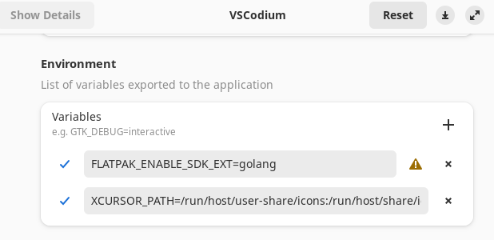
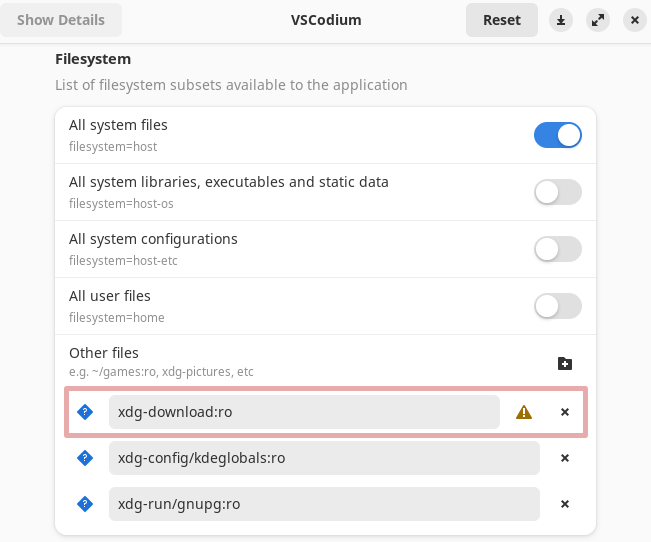
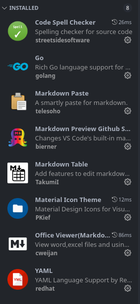

# VSCodium - Open Source VSCode

> VSCodium is a community-driven, freely-licensed binary distribution of [Microsoft’s editor VS Code](../Windows/vscode.md).

Home Page : <https://vscodium.com/>

Extensions Repository : <https://open-vsx.org/>

## Fix Command line access in Flatpak edition of VSCodium

We would need to add the following configuration to
`settings.json`:

```json
  // "terminal.integrated.defaultProfile.linux": "bash",
  "terminal.integrated.defaultProfile.linux": "bash-flatpak-spawn",
  "terminal.integrated.profiles.linux": {
    "bash-flatpak-spawn": {
      "path": "/usr/bin/flatpak-spawn",
      "args": [
        "--host",
        "--env=TERM=xterm-256color",
        "bash"
      ]
    }
  },
```

This would allow you to access the ***unprotected full system level command line***.

Be careful with this.

## Installation Flatpak edition of VSCodium with Golang support

```sh
sudo flatpak install flathub com.vscodium.codium
sudo flatpak install flathub org.freedesktop.Sdk.Extension.golang
```

In the second line select the proper version of the Golang
as per the version installed in your system.

Finally add the export option in **[`flatseal` app](https://flathub.org/apps/com.github.tchx84.Flatseal)**. 

[](./vscodium/vscodium-golang-ext_2024-01-07.png)

## Fix Golang issues in Flatpak edition of VSCodium

Normally the **[Go extension](https://open-vsx.org/extension/golang/Go)** would not be able to detect
correct path for `go` binary even though its installed
system wide.

Here is how you can go about installing Go and make it work with *Flatpak edition of VSCodium*.

### Installing Latest Golang under Linux

```sh
cd ~/Download

# Download the Go Install
wget -c https://go.dev/dl/go1.21.5.linux-amd64.tar.gz

# Do the Checksum
echo "e2bc0b3e4b64111ec117295c088bde5f00eeed1567999ff77bc859d7df70078e go1.21.5.linux-amd64.tar.gz" | sha256sum -c

# This will do the System wide install
sudo rm -rf /usr/local/go && sudo tar -C /usr/local -xzf go1.21.5.linux-amd64.tar.gz

# This is needed to make it work with VSCodium
tar -xzf go1.21.5.linux-amd64.tar.gz

# Add Golang into environment
echo "export GOROOT=/usr/local/go" | tee -a ~/.bashrc
echo "source \$GOROOT/go.env" | tee -a ~/.bashrc 
```

The last line would allow the Go binary to be available in `~/Downloads` directory.

**Warning!** Reboot or Logout-Login to make sure that the
changes are applied.

### Fix Permission for Downloads directory in `flatseal`

Next we need to add permission to access the Download directory using the **[`flatseal` app](https://flathub.org/apps/com.github.tchx84.Flatseal)**.

[](./vscodium/vscodium-golang-2024-01-07.png)

### Update VSCodium Settings to recognize Golang

Finally we would need to edit the `settings.json` and
add the following:

```json
  // @ Go Plugin
  "go.inferGopath": true,
  "go.toolsManagement.autoUpdate": true,
  "go.alternateTools": {
    "go": "~/Downloads/go/bin/go"
  },
  // Obsolete
  //"go.languageServerExperimentalFeatures": {
  //	"diagnostics": false
  //},
  "go.testFlags": [
    "-v"
  ],
  // ## End - Go Plugin
```

This would allow to access `go` from the `~/Downloads/go` path.

## Useful Extensions for VSCodium

[](./vscodium/Extensions_2023-11-21_09-55-16.png)


----
<!-- Footer Begins Here -->
## Links

- [Back to VSCode Aricle](../Windows/vscode.md)
- [Back to Linux Hub](./README.md)
- [Back to Root Document](../README.md)
