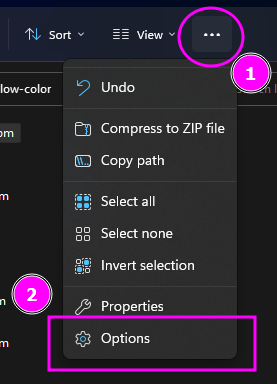
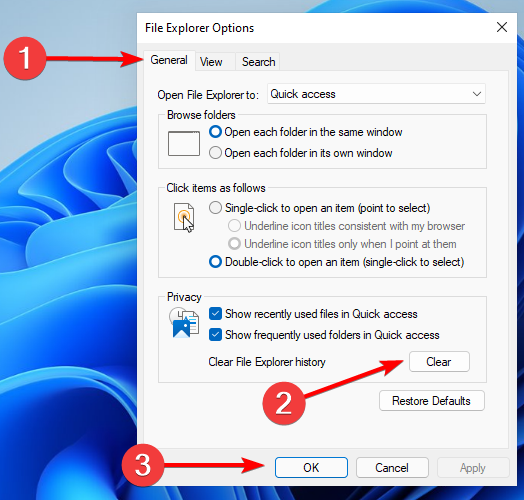

# Windows Hub

All about the Windows operating system and related tools.

## Topics

- **[MSYS2](./MSYS2.md)** - Linux tools in friendly package.
- **[VS Code](./vscode.md)** - Visual Studio Code the most popular editor.
    - ~~[dendon](./dendron.md)~~ - Data siphoning scam tainted note taking system. **DANGER !!!**
- **[Strange Windows - Ghost Specter](https://www.youtube.com/@GHOSTSPECTRE)** - Lean versions of Windows 7, Windows 10, Windows 11 **DANGER!!!**
- **[ponterface the 3D printer control GUI](./ponterface.md)** - Easy to use 3D printer control software.
- **[Windows Sub-System for Linux](./WSL.md)** - Linux running side by side windows.
- **[Windows Command Line](./cmd.md)** - Command line and many common operations.
- **[FreeCAD](./freecad.md)** - Mechanical CAD and 3D Printing tool.
- **[Syncthing for Windows](./syncthing-windows.md)** - Some quick Settings for the Syncthing tool.
- **[Notepad++](./notepadpp.md)** - Simple editor of Windows.
- **[Sublime-Text](./sublime-text.md)** - One of the older editors with python backing.
- **[`Keepassxc`](./keepassxc.md)** - Password Storage.
- **[IP-Messenger](./ip-messenger.md)** - Best PC to PC local network Sharing tool since 2004.
- **[Fast Copy](./fastcopy.md)** - Its like the `rsync` of Windows - Fastest copy and sync program for Windows.
- [QOwnNotes](./qownnotes.md) - Another QT base note taking software.
- **[Autodesk Fusion 360](./fusion360.md)** - Windows/Mac Mechanical CAD overlord.

## Windows Keyboard Shortcuts

**[PDF File](./README/List_of_all_Windows_10_keyboard_shortcuts.pdf)** containing all the shortcuts in detail.

## Backup windows product key

We can do this easily by opening the `regedit` and visiting the key

```regedit
HKEY_LOCAL_MACHINE\SOFTWARE\Microsoft\Windows NT\CurrentVersion\SoftwareProtectionPlatform
```

## Remove Watermark of Activate Windows10 due to connection problem

```regedit
HKEY_LOCAL_MACHINE\SYSTEM\CurrentControlSet\Services\svsvc
```

and

Set value `Start` = 4

Easier Script - Just save it as a `.reg` file :

```
Windows Registry Editor Version 5.00

[HKEY_LOCAL_MACHINE\SYSTEM\CurrentControlSet\Services\svsvc]
"Start"=dword:00000004
```

## How to tell if your PC is Hacked? Process Forensics

<https://www.youtube.com/watch?v=dykc9YC9Z6U>

Using : **Process Monitor** from `SysinternalsSuite` tools.

Download `SysinternalsSuite` from Microsoft

<https://learn.microsoft.com/en-us/sysinternals/downloads/sysinternals-suite>

## Easily reset the Graphics card if you are facing display issues

??? note "Keyboard Shortcut : <kbd>Win + Ctrl + Shift + B </kbd>"
    

## Hyper-V on Windows : a few guides

- How to Setup Hyper V on Windows

    <https://www.youtube.com/watch?v=FCIA4YQHx9U>

- How to setup/install Hyper V in Windows 11?

    <https://www.youtube.com/watch?v=6lfD2u45y_s>

- Windows Inside of Linux : Chris Titus

    <https://www.youtube.com/watch?v=6KqqNsnkDlQ>

## Bitvise SSH Client: Free SSH file transfer, terminal and tunneling

Home Page: <https://www.bitvise.com/ssh-client>

This works using both `putty's pagent` and **Windows OpenSSH**!!

It has functions for **SFTP** like `WinSCP` , *Terminal* like `putty` and also supports **RDP**.

## WinSSH-Pageant

Proxy `Pageant` requests to the **Windows OpenSSH** agent (from Microsoft), enabling applications that only support `Pageant` to use `openssh`.

> I use the Windows OpenSSH agent as my single ssh key backing. Many solutions exist that do the opposite of this, but I prefer the convenience of Windows OpenSSH agent.
>
> This has been tested on Windows 10 2004 using WSL2. Earlier versions of windows up to 1803 should work too.

Source : <https://github.com/ndbeals/winssh-pageant>

Install `winget install winssh-pageant`

***IMPORTANT:*** This is used to Allow Windows OpenSSH to work with **Putty**'s `pagent`, **Not the other way round!!!**.

### Autostart

Start Menu Autostart:

1. Open Windows Explorer and navigate to:

    ```
    %appdata%\Microsoft\Windows\Start Menu\Programs\Startup
    ```

2. Inside this folder, Create a shortcut pointing at wherever you put `winssh-pageant.exe`

 3. If the shortcut is valid, there should be a new `WinSSH-Pageant Bridge` entry found in Task Manager -> Startup

!!! note
    Task Scheduler autostart method is now deprecated and unsupported. It causes possible issues with executable ownership.

## Windows 10 Clean up

- Windows 10 cleanup and speed-up videos by Chris Titus
    - Speed up Windows 10 with One Command

        <https://www.youtube.com/watch?v=dO30OnTsJhk>

    - Making Windows Faster without Tools

        <https://www.youtube.com/watch?v=GOz_foQcPcY>

    - The Best Windows 10 Toolbox - GUI Explain

        <https://www.youtube.com/watch?v=V27McA7ch6w>

## Fix Windows10 BootLoader

- Boot using #Windows10 DVD or USB
- Press **`Shift+F10`** to open **Admin Command Console**
- Enter Commands in Sequence

  ```bat
  bootrec /FIXMBR
  bootrec /FIXBOOT
  bootrec /RebuildBcd
  ```

## Secure Remote Desktop in Windows

Source: <https://www.howtogeek.com/175087/how-to-enable-and-secure-remote-desktop-on-windows/>

**[PDF of the Article](./README/How-to-Enable-and-Secure-Remote-Desktop-on-Windows.pdf)**

## Logs for Reboot, Shutdown or any force turn OFF

Source: <https://www.johnyoung.tech/restart-and-shutdown-event-logs-for-windows/>

**[PDF of the Aricle](./README/Restart-and-Shutdown-Event-Logs-for-Windows.pdf)**

### Event ID: 41

The kernel power event ID 41 error occurs when the computer is shut down, or it restarts unexpectedly. Useful for identifying if a machine has uncleanly rebooted/shut down.

### Event ID: 1074

Indicates that an application or a user initiated a restart or shutdown. Useful for identifying a rogue service causing these events.

### Event ID: 1076

A really useful one as this one records your notes when the system has restored after an unexpected restart/shutdown. Usually I put in a resolution not here to record what I identified the cause to be.

### Event ID: 6008

Records that the system started after it was not shut down properly. May identify other things that may have been missed.

## Windows 10 Reg Test

Use an **Administrator Command Prompt**.

```
slmgr /ipk W269N-WFGWX-YVC9B-4J6C9-T83GX
slmgr /skms s8.uk.to
slmgr /ato
```

- Site for KMS to register the Windows Copy

    <https://kms.msguides.com/>

    1.  `s8.uk.to`
    2.  `s9.us.to`

## Generating SHA256 Hash for Files in Windows

Open a Powershell window and type:

```powershell
Get-FileHash linuxmint-20-cinnamon-64bit.iso -Algorithm SHA256
```

## Windows Folder Permission Fix for NTFS

We use the `icacls` Command.

- Microsoft Forums:
    <https://answers.microsoft.com/en-us/windows/forum/all/how-to-write-a-batch-file-to-change-folder/3d1a937a-ee98-452c-abde-9d8ea6e2a56e>

Its very common to get issues when the NTFS and other file systems gets mixed up. There arises problems with rights. Since some files get modified on another PC and some on Another. Hence the rights for files in the same folder can get changed in unexpected manner.

To fix this we need to do a rights reassignment.
Or a Windows version of `chmod` + `chown` commands.
Come the `icacls` command.

Run this in **Administrative Command Prompt**:

```batch
icacls "%UserProfile%\Desktop" /t /grant everyone:R "%UserName%":R System:F Administrators:F
```

This command would use Environment Variables:

- `%UserProfile%` This is the Windows User Home Directory
- `%UserName%` This is User Name of the current logged in User.

!!! note
    To execute the above command the user needs to be in the **Administrators** Group.

The `/t` switch does **sub-directory** level application of permissions.

In case there is issues with **inheritance** of permissions use this command in **Administrative Command Prompt**.

```batch
icacls "Full path of file or folder" /inheritance:d
```

Here is an easy to use command that helps fix **current directory** permissions and all things under it:

```batch
icacls .\ /t /grant everyone:R "%UserName%":R System:F Administrators:F
```

## Setting UAC level from Control Panel

We can secure the Windows ***UAC*** even further.

> .a.k.a. Run as Administrator Prompts in Windows

Go To: `Control Panel -> System and Security -> Security and Maintenance`

Under "User Account Control"

Open "Change settings"

Set level to Highest "Always notify me when: ..."

This would elevate to the maximum security on the UAC.
Any action that modifies the system would need to first go through an *UAC prompt* to work.

Many things would need explicit **Run in Administrator** to work.
This helps to enhance the security of Windows.

## Windows OpenSSH Install and Configuration

First, we need to find out which **OpenSSH** is compatible to our system.

### Good Introductory PDF Document on OpenSSH in Windows

[Get-started-with-OpenSSH-for-Windows-Microsoft-Learn.pdf](./README/Get-started-with-OpenSSH-for-Windows-Microsoft-Learn.pdf)

### Compatibility Check

Open an **Administrative PowerShell** window and Type the following:

```powershell
Get-WindowsCapability -Online | Where-Object Name -like 'OpenSSH*'
```

Output:

```powershell
Name  : OpenSSH.Client~~~~0.0.1.0
State : NotPresent

Name  : OpenSSH.Server~~~~0.0.1.0
State : NotPresent
```

### Installation

Here we need to *begin Install*:

```powershell

# Install the OpenSSH Client
Add-WindowsCapability -Online -Name OpenSSH.Client~~~~0.0.1.0

# Install the OpenSSH Server
Add-WindowsCapability -Online -Name OpenSSH.Server~~~~0.0.1.0
```

The Output would be :

```powershell
Path          :
Online        : True
RestartNeeded : False
```

Normally **OpenSSH Server** is not needed since we don't want our system to be even more *vulnerable* than it already is 🤣.

### Special Configuration for OpenSSH Server

In case *you decide to shoot yourself in the foot* and install **OpenSSH.Server** then you would need to perform this:

```powershell
# Start the sshd service
Start-Service sshd

# OPTIONAL but recommended:
Set-Service -Name sshd -StartupType 'Automatic'

# Confirm the Firewall rule is configured. It should be created automatically by setup. Run the following to verify
if (!(Get-NetFirewallRule -Name "OpenSSH-Server-In-TCP" -ErrorAction SilentlyContinue | Select-Object Name, Enabled)) {
    Write-Output "Firewall Rule 'OpenSSH-Server-In-TCP' does not exist, creating it..."
    New-NetFirewallRule -Name 'OpenSSH-Server-In-TCP' -DisplayName 'OpenSSH Server (sshd)' -Enabled True -Direction Inbound -Protocol TCP -Action Allow -LocalPort 22
} else {
    Write-Output "Firewall rule 'OpenSSH-Server-In-TCP' has been created and exists."
}
```

### Start the SSH Agent Automatically - For OpenSSH Client

Now this we need. This helps to keep your precious keys in **KeepassXC** and then activate them when needed.

We need this to work with **git** and here is how `ssh-agent` is configured:
- Open the **Services** from *Start Menu*.
- Find the **OpenSSH Authentication Agent** Service.
- And Setup for **Automatic (Delayed-start)**.
-
Initially It would be in *Disabled* state, we need it work every time we start windows so we make it auto start.

## Windows 11 Installation

### Bypass TPM 2.0, CPU, RAM, Secure Boot Check

Reference:

- Fix: This PC can't run Windows 11 (Bypass TPM and Secure Boot) <https://www.youtube.com/watch?v=q9lq4FcDK4k>
- Safely Bypass the TPM 2 0, CPU,RAM, Secure Boot Requirement in Windows 11 <https://www.youtube.com/watch?v=GNpewOl4yqk>

**WARNING !!!** Windows might not support the TPM less hardware in Future.

Here are Steps:

1.  Boot up the System using the Windows 11 Boot Media.
2.  Once inside the Install Proceed to screen
    "Select the operating system you &#x2026;"
3.  Press `Sift + F10` to Bring up **Administrator Terminal**
4.  Open **Registry Editor** = `regedit`
5.  Locate `HKEY_LOCAL_MACHINE/SYSTEM/Setup` then
    Create a Key `LabConfig` and Select it.
6.  Create 4 of the `DWORD (32-bit) Value` :
    -   `BypsssTPMCheck` = 1
    -   `BypassRAMCheck` = 1
    -   `BypassSecureBootCheck` = 1
    -   `BypassCPUCheck` = 1
7.  Close the Registry Editor and then continue the Windows Setup.

### Bypass Internet Connection requirement at Install

There is a bit of jugglery to be performed to get the connection with internet requirement disabled.

We would need to keep terminating a particular process `oobenetworkconnectionflow.exe` during install.

When the question is asked in the setup process to connect to Internet press `Shift + F10` together.
This would open the **Administrator Terminal**.

```batch
taskkill /f /IM oobenetworkconnectionflow.exe
```

This would lead to the setup showing some thing went wrong.
Don't worry - Click on **Retry** and setup would again ask for Network.

Use `Alt + Tab` to switch back to the **Administrator Terminal** and type the terminating command again.

These steps might take several times to repeat.
Till you get the **Who will use this .... Name** prompt.

Once you get to this point `Alt + Tab` to the **Administrator Terminal** and `exit` it.

The setup would continue as usual.

### Temp Activation using KMS

Reference:

- Video <https://www.youtube.com/watch?v=YMKnv7CXAGs>
- Product Keys <https://learn.microsoft.com/en-us/windows-server/get-started/kms-client-activation-keys>

In an **Administrator Command Prompt**

```batch
@REM COMMANDS:
Entering Product Keys

@REM LINE 1:
slmgr /ipk *product key*

@REM Connecting Windows to KMS Organisation Server
@REM LINE 2:
slmgr /skms s8.uk.to

@REM Activating Windows
@REM LINE 3:
slmgr /ato

@REM PS: Replace *product key* with the product key from kms link
```

Product Keys [Link](https://learn.microsoft.com/en-us/windows-server/get-started/kms-client-activation-keys):

| Operating System                                                       | KMS Client Product Key        |
| ---------------------------------------------------------------------- | ----------------------------- |
| Windows 11 Pro <br /> Windows 10 Pro                                   | W269N-WFGWX-YVC9B-4J6C9-T83GX |
| Windows 11 Pro for Workstations <br /> Windows 10 Pro for Workstations | NRG8B-VKK3Q-CXVCJ-9G2XF-6Q84J |
| Windows 11 Enterprise <br />Windows 10 Enterprise                      | NPPR9-FWDCX-D2C8J-H872K-2YT43 |

## Windows 11 File Explorer Crashing or Hanged problem

References :

1.  Windows 11 File Explorer Takes Forever to Load  <https://answers.microsoft.com/en-us/windows/forum/all/windows-11-file-explorer-takes-forever-to-load/8c874274-c6c3-4b17-9d04-d0f42bd1465e>
2.  Windows Explorer issues in Windows 11 22H2
    <https://answers.microsoft.com/en-us/windows/forum/all/windows-explorer-issues-in-windows-11-22h2/5041676a-a92b-4406-a29b-c3821a7dbb3c>
3.  Fix Windows 11 Explorer
    <https://windowsreport.com/windows-11-file-explorer-crashing/>

### Solution 1 : Restart Explorer

This might be just the easiest solution but effective sometimes.

-   Press `Ctrl + Shift + Esc` This would open **Task Manger**
-   Click on the **Processes** Tab
-   If the process are not sorted by name then press `Name` column once. This would start to show the `Apps (..)` and `Background processes`.
-   Now under `Apps` find **Windows Explorer** and terminate all Tasks.
-   Finally scroll below in `Windows processes` find **Windows Explorer**. There might be multiple instances.
-   Restart the process **Windows Explorer** under the `Windows processes`.

This would be *band aid fix*. If this works then you need to **Restart** your PC as its memory corrupted in **Standby** or **Sleep** or **Hibernation** modes.

### Solution 2 : Start Up cleaning (Restart Needed)

In this solution we can find the problematic services or Virus
that is causing our problem.

-   Open the **Run Prompt** using `Meta + R` or `Windows Key + R` combination.
-   Type the command `msconfig` and **click ok**. This would open **System Configuration** window.
-   Go to the **Services** tab and *check* **Hide All Microsoft Services**
-   This gives a list of *start-up* services running in the PC. If you find any suspicious service **deactivate/un-check** it.
-   Finally restart the PC to see if the problem is gone.

Diagnosis 1: In case some thing breaks and the problem got solved the possibly some software installed had caused the issue.

Diagnosis 2: Problem is not solved and something breaks then we would need to re-enable that service we deactivated at startup.

Diagnosis 3: Problem is Solved and everything works fine then we found the specific service that has caused the issue. In this case find out more about that particular service from Internet.
And if there are any way to permanently remove them from the PC.

### Solution 3 : Resource Checker Scan and Fix (Restart Needed)

In case some system files have got corrupt or misplaced we need to fix
that.

1.  Scan Fix

    -   Open an **Administrative Command Prompt**
    -   Type the Command:
        `sfc /scannow`
    -   This would try to fix the problems with the Windows system files.
    -   Restart the System after the command completes.

2.  Check Disk

    -   It might be a good idea to check all your disks for any errors.
    -   Use this command in **Administrative Command Prompt**
        `chkdsk /f /r /b`
    -   This would run for all the disks in the system.

3.  Microsoft Resource Checker Software **help**

```
This is the `sfc` command:

    C:\Windows\System32>sfc --help

    Microsoft (R) Windows (R) Resource Checker Version 6.0
    Copyright (C) Microsoft Corporation. All rights reserved.

    Scans the integrity of all protected system files and replaces incorrect versions with
    correct Microsoft versions.

    SFC [/SCANNOW] [/VERIFYONLY] [/SCANFILE=<file>] [/VERIFYFILE=<file>]
        [/OFFWINDIR=<offline windows directory> /OFFBOOTDIR=<offline boot directory> [/OFFLOGFILE=<log file path>]]

    /SCANNOW        Scans integrity of all protected system files and repairs files with
                    problems when possible.
    /VERIFYONLY     Scans integrity of all protected system files. No repair operation is
                    performed.
    /SCANFILE       Scans integrity of the referenced file, repairs file if problems are
                    identified. Specify full path <file>
    /VERIFYFILE     Verifies the integrity of the file with full path <file>.  No repair
                    operation is performed.
    /OFFBOOTDIR     For offline repair, specify the location of the offline boot directory
    /OFFWINDIR      For offline repair, specify the location of the offline windows directory
    /OFFLOGFILE     For offline repair, optionally enable logging by specifying a log file path

    e.g.

            sfc /SCANNOW
            sfc /VERIFYFILE=c:\windows\system32\kernel32.dll
            sfc /SCANFILE=d:\windows\system32\kernel32.dll /OFFBOOTDIR=d:\ /OFFWINDIR=d:\windows
            sfc /SCANFILE=d:\windows\system32\kernel32.dll /OFFBOOTDIR=d:\ /OFFWINDIR=d:\windows /OFFLOGFILE=c:\log.txt
            sfc /VERIFYONLY
```

### Solution 4 : Cleaning the Cache of Explorer

This might be a contrived one but some times does works.

-   Open the **File Explorer Options**<br />
   

-   Now we need to Clean Up the list of **Recent files**<br />
   

### Solution 5 : **Nuclear Option** Repair Windows 11 Image (Restart Needed)

This is a last option resort if everything else fails.

-   Open a **PowerShell** as **Administrator**
-   Type the following Command:  `Repair-WindowsImage -Online –RestoreHealth`
-   Restart your PC and wait for the Process is completed.

This will restore the windows to a previous good configuration.
It would be more like a *Windows system update* in this case targeted to your software installs.

The same command can be used in a **Administrative Command Prompt** as :
`DISM.exe /Online /Cleanup-image /Restorehealth`

### Solution 6 : Create a new User Account (Restart Needed)

This might be a drastic option.
You can create a new Local Login account using the **Control Panel**
Or in the **Run Console** type (`Meta+r` to bring up):
`control userpasswords2`
This would open the **Control Panel** to a user creation area.
Now create a user with **Administrators** group membership.
This would become your new local account.

## Make utility in Windows and more Utilities

Typically this falls under the well known **GNUWin32** tools project.

Home Page <https://gnuwin32.sourceforge.net/>

We can install the same using **`winget`**

```batch
@REM for Make
winget install --id GnuWin32.Make

@REM for wget
winget install --id GNU.Wget2
```

Interesting `curl` is already present.

## Force windows to use one network/WiFi adapter

Reference:

- <https://answers.microsoft.com/en-us/windows/forum/all/how-to-force-windows-to-use-one-network-adapter/dc4e36aa-94f5-433b-93a2-3da7d46a0e5d>

Here are the Steps:

- Open Settings.
- Click on Network & Internet.
- Click on Status.
- Click the Change Adapter options item.
- Right-click the network adapter you want to prioritize, and select Properties
- Select the Internet Protocol Version 4 (TCP/IPv4) item.
- Click the Properties button.
- In the "General" tab, click the Advanced button.
- Clear the Automatic metric check-box.
- In the "Interface metric" field assign a priority value for the adapter.
    - **Quick Tip**: The *lower the metric number* means *higher priority*,
    - and a *higher number* indicates *lower priority*.
- Click the OK button.
- Click the OK button again.
- Click the Close button.

Additionally we disable a particular adapter:

- Computer Management, Devices, right click your on board device and select "disable this device"

----
<!-- Footer Begins Here -->
## Links

- [Back to Root Document](../README.md)
