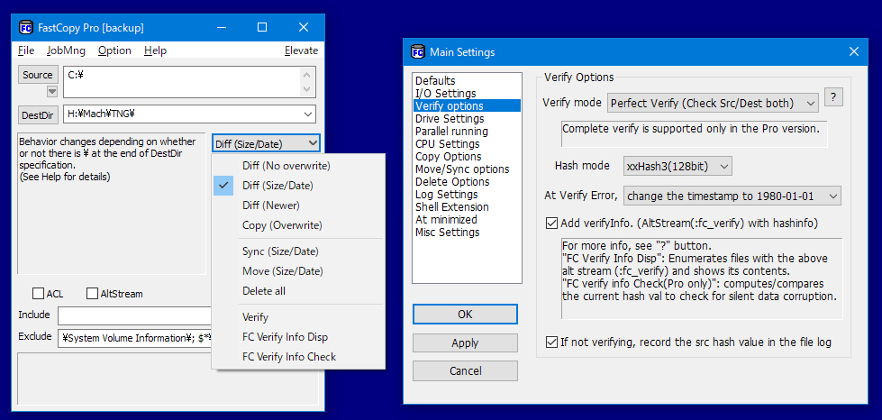
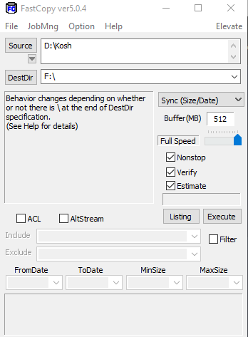
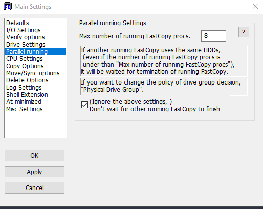

# FastCopy - Fastest copy and sync process for Windows

Home Page
<https://fastcopy.jp/>

Github Page older original FastCopy in Java
<https://github.com/mhisoft/fastcopy>

## Typical Settings

Sync Service like FreeFileSync

For Parallel Copy

or you can complete remove it by *Unchecking - ( Ignore above settings .)*.

----
<!-- Footer Begins Here -->
## Links

- [Back to Windows Hub](./README.md)
- [Back to Root Document](../README.md)
