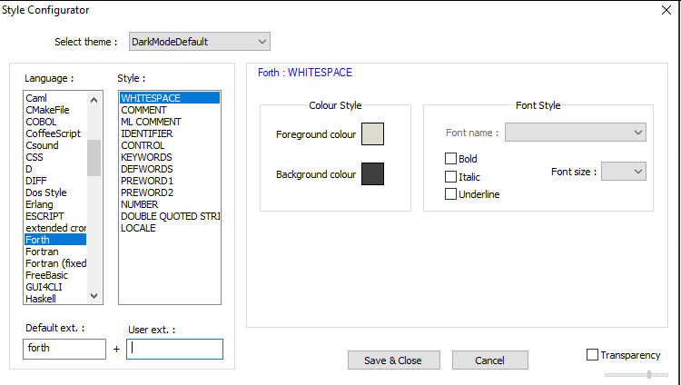
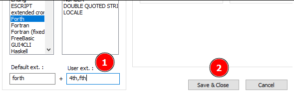
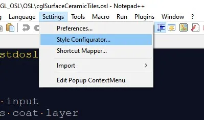
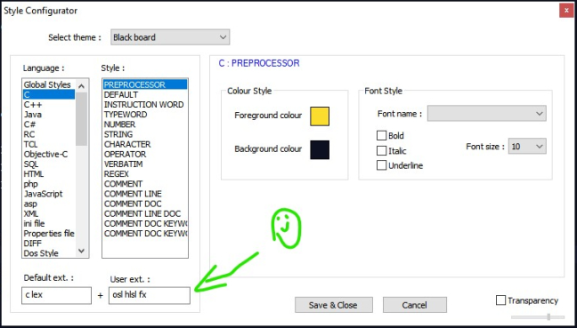

# Notepad++

The best and simple text editor on Windows.

Homepage <https://notepad-plus-plus.org/>

## Notepad++ Support Forth Source code file with custom Extension

By default the **Notepad++** program supports Forth.
But the file extension allocated is not correct.

First we need to open the Forth settings for this:
`Settings->Style Configuration...->Language : -> Forth`

Picture showing the Notepad++ Forth Settings:

The default extension is `.forth` this is a bit weird.

We need to add our required extensions to **User ext.:** field.

Picture showing how to add custom extensions in Notepad++:

##  Notepad++ Associate file extensions to language

1. Open the *Settings* Menu and select *Style Configurator...*

    

2. Select the **Language** you wish to add the File extension to.

3. In the **User ext.** field enter the File extension without `.` dot.

    

### Reference

<https://odederell3d.blog/2020/06/18/associate-file-extensions-to-language-in-notepad/>

----
<!-- Footer Begins Here -->
## Links

- [Back to Forth Hub](../Lang/Forth/README.md)
- [Back to Windows Hub](./README.md)
- [Back to Root Document](../README.md)
