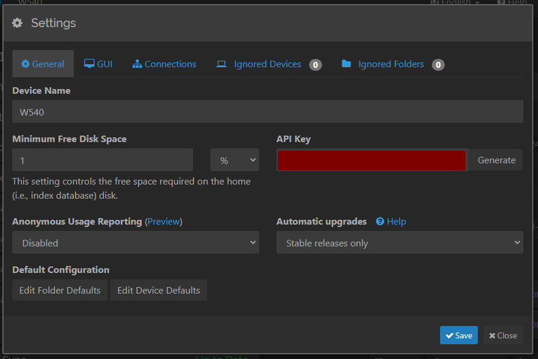
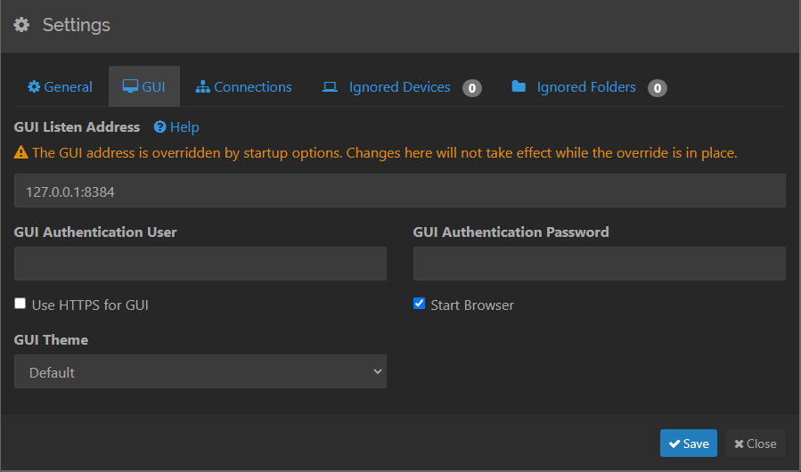
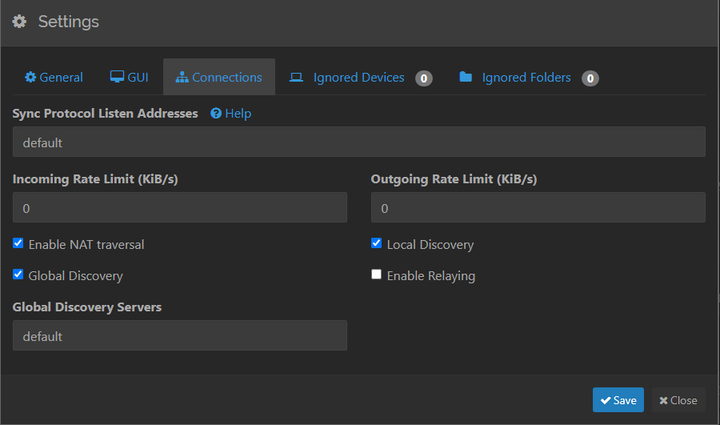

# Syncthing for Windows

## Common Settings
I have tried to take a snapshot of the settings that I using on the PC.

Here are the tabs:

#### General Tab

#### GUI Tab

#### Connections Tab - **Most Important**

> Keep the __**Global Discovery**__ Off at all times unless you want to bridge someone off via VPN.

----
<!-- Footer Begins Here -->
## Links

- [Back to Windows Hub](./README.md)
- [Back to Root Document](../README.md)

