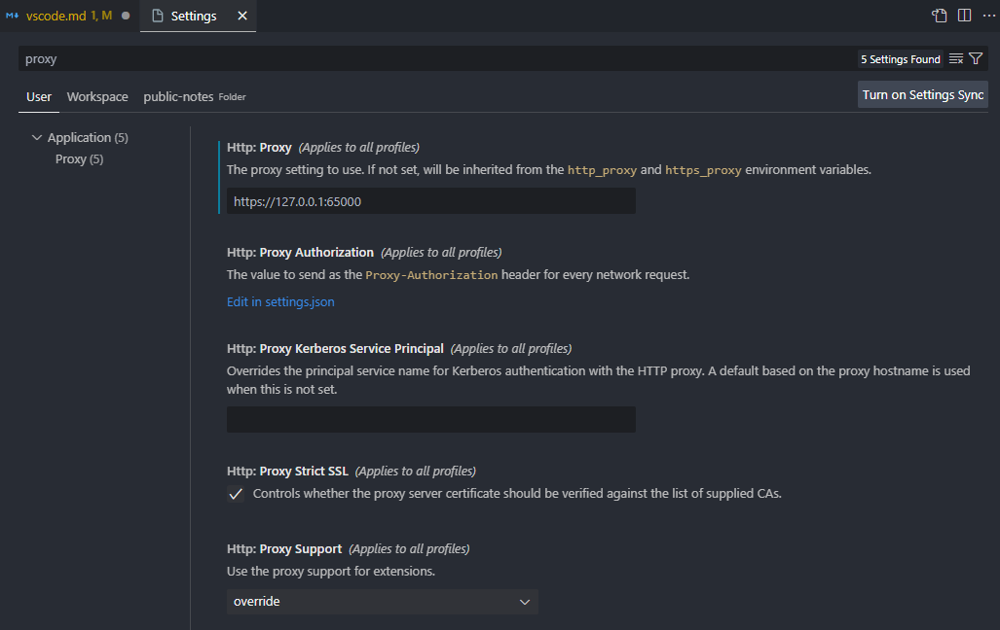
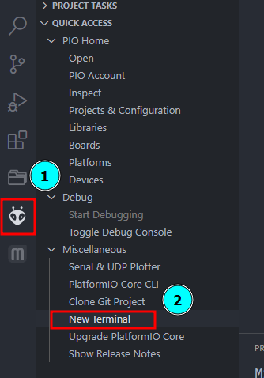

# Visual Studio Code : VSCode

## Workspace Trust settings

- `CTRL + SHIFT + P` Open *Command Palette*
- Type **"Manage Workspace Trust"**

Reference:

- <https://code.visualstudio.com/docs/editor/workspace-trust#_trusting-a-workspace>

## Prevent VS Code from connecting to the Internet

Add the following Setting into your `settings.json` file:

```json
    "http.proxy": "https://127.0.0.1:65000", // Prevent Internet connection
```

Edit this part:

[](./vscode/vscode-proxy-bypass.png)

**And you get rid of the pesky telemetry from VS Code altogether !!**

### Restore Updates

Now to enable updates you need to close all files.

And safely comment out the *proxy setting* in `settings.json`, or remove it from the UI.

## VS Code Snippets Usage and Creation

- Help on How to begin Creating

    <https://code.visualstudio.com/docs/editor/userdefinedsnippets>

- Generator = <https://snippet-generator.app/>

- Videos
    - [How To Create Custom VSCode Snippets](https://www.youtube.com/watch?v=TGh2NpCIDlc)
    - [Effortless Snippet Creation - VSCode Pro Tip](https://www.youtube.com/watch?v=3flfk1h6_PE)
    - [Code Faster With Custom VS Code Snippets](https://www.youtube.com/watch?v=JIqk9UxgKEc)
    - [Code Faster With Custom VS Code Snippets](https://www.youtube.com/watch?v=JIqk9UxgKEc)
    - [VSCode IDE Advanced Custom Snippets](https://www.youtube.com/watch?v=_tTxjaORmTg)

## Regex to replace wiki-links in Markdown

!!! note
    This is done using the *Regex replace* in **VS Code**.

### Regex to Replace the Wiki-links alone

```regex
\[\[(.*)\|(.*)\]\]
[$1]($2.md)
```

The first line would select the two parts of Wiki-Links.

Second line would convert it into a normal Markdown link.

There is another one where only *one piece* is mentioned.

```regex
\[\[(.*)\]\]
[$1]($1.md)
```

### Regex to Replace Image Wiki-links

```regex
!\[\[(.*)\|(.*)\]\]
$1\n
```

This would make sure that the Alt comment is shown as well as embedded for the missing image.

----

## General Packages

#### [Code Spell Checker](https://marketplace.visualstudio.com/items?itemName=streetsidesoftware.code-spell-checker) by streetsidesoftware

For Code and document spell Checking

#### [Go](https://marketplace.visualstudio.com/items?itemName=golang.Go) by Go Team at Google

Essential for `Golang`.

#### [C/C++](https://marketplace.visualstudio.com/items?itemName=ms-vscode.cpptools) by Microsoft

Basic `C/C++` support extensions.

#### [PlatformIO IDE](https://marketplace.visualstudio.com/items?itemName=platformio.platformio-ide) by PlatformIO

The base `Arduino` in `VS Code`.

**Don't forget to disable <u>telemetry</u> on this one.**

- Open a Platform I/O Terminal :

    

- Type the Following :

    `pio settings set enable_telemetry 0`

    This would disable the <u>telemetry</u>.

- To Verify the setting have taken effect :

    `pio settings get`

- Finally **restart VS Code**.
- **Note:** This would only work *after the Platform IO tools have installed correctly*.

#### [Lua](https://marketplace.visualstudio.com/items?itemName=sumneko.lua) by sumneko

For support on `Lua` editing and formatting.

#### [Material Icon Theme](https://marketplace.visualstudio.com/items?itemName=PKief.material-icon-theme) by Philipp Kief

Change the default Icons to something nice.

#### ~~[Project Manager](https://marketplace.visualstudio.com/items?itemName=alefragnani.project-manager) by alefragnani~~ **(Not Used)**

~~This helps to create a database of project links. That helps to quickly switch to different project types.~~

#### ~~[Path Intellisense](https://marketplace.visualstudio.com/items?itemName=christian-kohler.path-intellisense) by Christian Kohler~~ **(Not Used)**

~~This helps to quickly find the path of resources in the current project/Workspace.~~

#### [YAML](https://marketplace.visualstudio.com/items?itemName=redhat.vscode-yaml) by Red Hat

Good extension supporting `YAML` in multiple places.

**Don't forget to disable <u>telemetry</u> on this one.**

----

## 3D Printer Firmware Specific Packages

#### Auto Build Marlin by Marlin Firmware

To Build the 3D printer `marlin` Firmware.


----
## ARM Related Packages

#### CMake by twxs

This helps to hand the CMake based projects better

#### Cortex-Debug by marus25

For ARM MCU debugging.

**Don't forget to disable <u>telemetry</u> on this one.**

#### debuf-tracker-vscode

Needed for Cortex Debug and installed Automatically

#### Peripheral Viewer

For Cortex Debug extensions.

#### MemoryView

For Cortex Debug extension.

#### RTOS Views

For Cortex Debug extensions.

#### SVD Viewer by cortex-debug

This helps to view and edit the SVD table from chip
Manufacturer.

----
## nRF Connect Specific Packages

#### GNU Linker Map Files by Trond Snekvik

For `nRF Connect` SDK.

#### nRF Connect for VS Code by Nordic Semiconductors

Part of nRF Connect SDK.

#### nRF Connect for VS Code Extensions Pack by Nordic Semiconductors

Full load of all the extensions needed for nRF Connect SDK.

#### nRF Device Tree by Nordic Semiconductors

Part of nRF Connect SDK.

#### nRF Kconfig by Nordic Semiconductors

Part of nRF Connect SDK.

#### nRF Terminal by Nordic Semiconductors

Part of nRF Connect SDK.

----
## Markdown Specific Packages

#### [Markdown All in One](https://marketplace.visualstudio.com/items?itemName=yzhang.markdown-all-in-one) by Yu Zhang

Best Markdown shortcuts and process.

#### [Markdown Footnotes](https://marketplace.visualstudio.com/items?itemName=bierner.markdown-footnotes) by Matt Bierner

Adds `[^footnote]` [^1] syntax support to VS Code's built-in markdown preview

[^1]: This is a footnote. Typed after the section.

#### [Markdown Paste](https://marketplace.visualstudio.com/items?itemName=telesoho.vscode-markdown-paste-image) by telesoho

This helps to create images right from the Keyboard
and the produce the file in the local directory.
It also helps to add the Images directly to the document.
It works very close to the `Dendorn Image Paste`.

#### [Markdown Preview Github Styling](https://marketplace.visualstudio.com/items?itemName=bierner.markdown-preview-github-styles) by Matt Bierner

Default preview in Github Flavored Markdown style.

#### [Markdown Preview Mermaid Support](https://marketplace.visualstudio.com/items?itemName=bierner.markdown-mermaid) by Matt Bierner

Helps to see `mermaid` drawings in preview:


#### [Markdown Table](https://marketplace.visualstudio.com/items?itemName=TakumiI.markdowntable) by Takumi Ishii

Helps with proper formatting for Markdown Tables.

#### ~~[Markdown Table Prettifier](https://marketplace.visualstudio.com/items?itemName=darkriszty.markdown-table-prettify) by Krisztian Daroczi~~ **(Not Used)**

~~Helps to cleanup the Markdown Tables easily.~~

#### [Office Viewer(Markdown Editor)](https://marketplace.visualstudio.com/items?itemName=cweijan.vscode-office) by Weijan Chen

This helps to open various file formats embedded in Markdown documents.
Eg. Extensions include `.xls`, `.xlsx`, `.csv` , `.zip`, `.jar`, `.pdf`, `.svg` .etc.

#### ~~[vscode-pdf](https://marketplace.visualstudio.com/items?itemName=tomoki1207.pdf) by tomoki1207~~ **(Not Used)**

~~This helps to view PDF documents to be viewed on VS Code directly.~~

#### ~~[vscode-reveal](https://marketplace.visualstudio.com/items?itemName=evilz.vscode-reveal) by evilz~~ **(Not Used)**

~~For Markdown based presentation using Reveal JS.~~

----
<!-- Footer Begins Here -->
## Links

- [Back to Windows Hub](./README.md)
- [Back to Root Document](../README.md)


