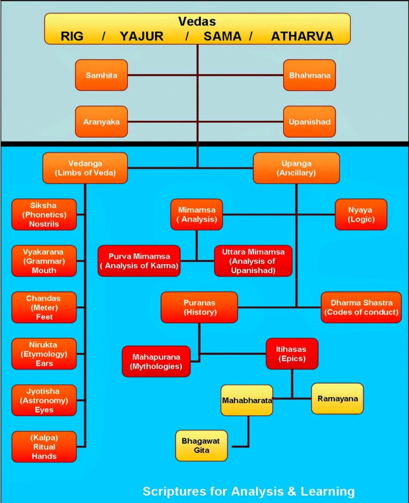

# Misc Section

All uncertain documents file in here.

## Topic

- Firefox Extension: Bypass Paywalls Firefox Clean
    - <https://gitlab.com/magnolia1234/bypass-paywalls-firefox-clean>
    - Add-on allows you to read articles from (supported) sites that implement a paywall.
- [USB drive / PenDrive Recovery software](./usb-drive-recovery-software.md)
- [Android Loading for Lenovo Vibe K5 Plus](./Lenovo-Vibe-K5-plus.md)
- **[Chrome Browser Variants](./chrome-browser.md)** - Non-Google Chrome browsers.
- **[Firefox Browser](./firefox-browser.md)** - Ensuring privacy is maintained and configured correctly.
- **[LibreWolf](./librewolf-browser.md)** - Truly secure version of Firefox.
- **[Tiddly Wiki](./tiddly-wiki.md)** - Personal Wiki in a Single HTML file.
- [Some old LATHI PIC32 Links](./LATHI-PIC32-links.md)
- [Various types of useful knots](./knots.md) - Very useful skill.
- [Happy Anime collection](./anime.md)
- [Reuse Ender-3 older Motherboards](./reuse-old-ender3-boards.md)
- [Post Quantum Crypto](./pqc.md)
    - NIST selected [kyber](./pqc-kyber.md) Algorithm
- [Kannan the Water Meter Story](./kannan-water-meter.md)
- F**ree Domains for Testing** - Yes real web domains for Free
    - <https://www.freenom.com>
    - Very slow DNS but works
- **`neocities` : Free HTML Websites** like the older `geocities`
    - Home Page: <https://neocities.org/>
- Android Jellybean Build Instructions

    ```sh
    cd android-4.3_r1
    . ./build/envsetup.sh
    lunch 6
    adb reboot bootloader
    cd nakasi-jwr66v
    ./flash-all.sh
    ```

    After this the phone would automatically reboot Done!
    `nakasig-jwr66v-factory-aebc7b11.tgz`

- [Some Game cheat codes](./game-cheat-codes.md) - Making it easier to play.
- Morse Code Reference

    Found a nice reference to Morse-code,
    This is the Morse code names used by US marines.

    [](./README/morse.png)

    These can be also used over communication links to spell out names.

- [Antifragility](./antifragility.md) - A concept to live by for better life.
- Mindfulness Meditation 10 Minutes <https://www.youtube.com/watch?v=ZToicYcHIOU>
- [UPI Payment URI and UPI QR Code information](./upi-payment-uri-qr-code.md)
- [Google Cloud Platform `gcp`](./gcp.md)
- [crytool for Android](./cryptool-android.md) - Security tool on Android Phones and tablets.
- [`sx` Golang Based Network Scanner Program](./sx-golang.md)
- **[Excalidraw](https://excalidraw.com/)** - Free Online Whiteboard for Meetings and classes.
- **[SSD Endurance](./ssd-endurance.md)** - How long with the SSD Last is measured by SSD Endurance.


### Indian Navy Chooses the new Naval Ensign 2nd Sept 2022

<https://twitter.com/ShivAroor/status/1565555745223069697>


With the national flag on the upper canton and a blue octagonal shape encompassing the national emblem, sitting atop an anchor depicting steadfastness, and superimposed on a shield with the Navy’s motto, `Sha Nau Varunah` in Devanagari script.

News article:
<https://www.opindia.com/2022/09/pm-modi-seal-of-chhatrapati-shivaji-maharaj-indian-navys-new-ensign-drops-st-georges-cross-colonial-burden/>

### Indian Air Force chooses the new Ensign 8th October 2023

> Below the Ashoka Lion is a depiction of a Himalayan eagle with outstretched
> wings, symbolising the fighting spirit of the IAF.
> Surrounding the Himalayan eagle is a light blue ring with the inscription
> "Bhartiya Vayu Sena."
> The IAF's motto, "Touching the sky with glory," is written in golden
> Devanagari script beneath the eagle, inspired by the Bhagavad Gita.

<center>[](./README/Bharateya-Airforce-ensign.jpg)</center>

Swarajya Article:

<https://swarajyamag.com/defence/one-year-after-the-navy-indian-air-force-unveils-new-ensign-on-air-force-day>

### Why We need to fast on Ekadashi ? The Scientific Answer

You-tube Video: <https://www.youtube.com/watch?v=XcUYf7kffQU>

Collected Materials:

- <https://www.youtube.com/watch?v=XcUYf7kffQU>
- <https://www.nobelprize.org/prizes/medicine/2009/press-release/>
- <https://spokane.wsu.edu/research/2021/07/15/test-making-impact-research-identifies-potential-role-junk-dna-sequence-aging-cancer/>
- <https://pubmed.ncbi.nlm.nih.gov/21429730/>
- <https://www.bluezones.com/2018/10/fasting-for-health-and-longevity-nobel-prize-winning-research-on-cell-aging/>#
- <https://www.nobelprize.org/prizes/medicine/2016/summary/>
- <https://www.nhlbi.nih.gov/news/2016/new-study-shows-eating-processed-meat-may-shorten-telomeres-raise-disease-risk-american>

### Tax back calculation or TDS Adjust Calculation

It's an important way to reverse calculate the cost of an item or job rate.

Here are the factors we would like to look into:

- `y` The *final sale price* or the one *Charged from customer*
- `x` The *Cost price* or Input price or the *amount you wish to get after Tax / TDS deduction*
- `T` *Total tax deducted*
- `z` The *rate of Tax* or *TDS* - This is typically a *percentage value*

Here is what we know:

- `y = x + T` means that total or *final sale price* is the sum of the *Cost price* and *Total tax deducted*
- `T = y * Z` means that *Total tax deducted* is the portion *rate of Tax* of the *final sale price*

Now, Substituting

`y = x + y * z`

`or, y * (1-z) = x`

` Hence, y = x / ( 1 - z) ` == `FPE`

This is an important find. Let's call this as the **Final Price Equation** or `FPE` in short.

#### Example of TDS Calculation

*Cost Price* `x = ₹ 2,000 /-`
*TDS* `z = 10% = 0.1`

Hence putting this into `FPE`

`y = x / ( 1 - z) = ₹ 2,000 / ( 1 - 0.1 ) = ₹ 2,222.22/-`

Now, we know the *final sale price* `y` Let's calculate the `T`  *Total tax deducted*

`T = y * z = ₹ 2,222.22 * 0.1 = ₹ 222.22/-`

Hence, *TDS* becomes `₹ 222.22/-` and *final sale price* is `₹ 2,222.22/-`

We know `y = x + T` Hence `x = y - T`

Let's put the values:

`x = y - T = ₹ 2,222.22 - ₹ 222.22 = ₹ 2,000/-`

Hence we get back the the original `x` even after *TDS*.

This is wise way to move out the *TDS* and *Tax* liabilities towards the paying customer.

#### Example of GST Calculation

*Cost Price* `x = ₹ 2,000 /-`
*GST Slab* `z = 18% = 0.18`

Hence putting this into `FPE`

`y = x / ( 1 - z) = ₹ 2,000 / ( 1 - 0.18 ) = ₹ 2,439.02/-`

Now, we know the *final sale price* `y` Let's calculate the `T`  *Total tax deducted*.

`T = y * z = ₹ 2,439.02 * 0.1 = ₹ 439.02/-`

We know `y = x + T` Hence `x = y - T`

Let's put the values:

`x = y - T = ₹ 2,439.02 - ₹ 439.02 = ₹ 2,000/-`

Hence we get back the the original `x` even after *GST* deduction.

This way we can set the correct price of items when selling things.

### House Search Checklist of 2011 Bharat

- [ ] Doors and windows are alright non-open
- [ ] No blocked entry and edge windows
- [ ] Pump on separate meter + if not then there are special Distribution scheme
- [ ] Water Bill or Distribution scheme
- [ ] Taps , Washbasin , Geyser flow and Power Switches
- [ ] Grounding for Computer
- [ ] Proper Appliance connection plugs and Lighting connections
- [ ] Plug points location for Computer , Electronics, TV and Appliances
- [ ] Nearest ATM
- [ ] Bank Branches
- [ ] Recharge Mobile shop
- [ ] Hair Cutting Place
- [ ] Groceries shop
- [ ] Vegetable Shop
- [ ] Stationary Shop
- [ ] Electricity Status - Current offs and power fluctuations
- [ ] Tanker Service for Water Distribution
- [ ] Petrol Pump
- [ ] Bike Repair shop
- [ ] Distance noise creating sources - Church, Mosque and Pubs .etc.

## Reopen a closed tab in any Browser

Just press <kbd>Ctrl + Shift + t</kbd>.

Press `Ctrl + Shift + t`

## Online Translation for Languages, Documents, Web Pages

Free Online Translator - Preserves your document's layout (PDF, Word, Excel, PowerPoint, OpenOffice, text)

<https://www.onlinedoctranslator.com/en/translationform>

DuckDuck Go Translator:

<https://duckduckgo.com/?q=translate&t=ffab&ia=web>

Google Translator:

<https://translate.google.com/>

## Bharateya Scriptures study



## Keybase.io **!! DO NOT USE !!**

Home Page: <https://keybase.io/>

Encrypted GPG solution for key sharing.

**Recently bought by Zoom company. !! DANGER !!**

**Hence *keybase.io* can't be trusted any more !**

**!! Untrusted Chinese Software !!**

- We get 250GB for Individual Use - Encrypted Repository

    <https://book.keybase.io/files>

- Tooling Tuseday - Learning about Keybase

    <https://www.youtube.com/playlist?list=PL8apXttwwN4k-gVqB2-Fszyh5-5fUL6iz>

- Windows How to Keybase - Windows Guide to using Keybase.io's Encrypted Git Repository

    <https://www.youtube.com/watch?v=JEqPaXmzYXQ>

- TechEduTips - Keybase

    <https://www.youtube.com/watch?v=BP7pIBYjdWQ>


### Alternative to Keybase.io is <https://keys.pub/>

Safer alternative is <https://keys.pub/>.


----
<!-- Footer Begins Here -->
## Links

- [Back to Root Document](../README.md)
