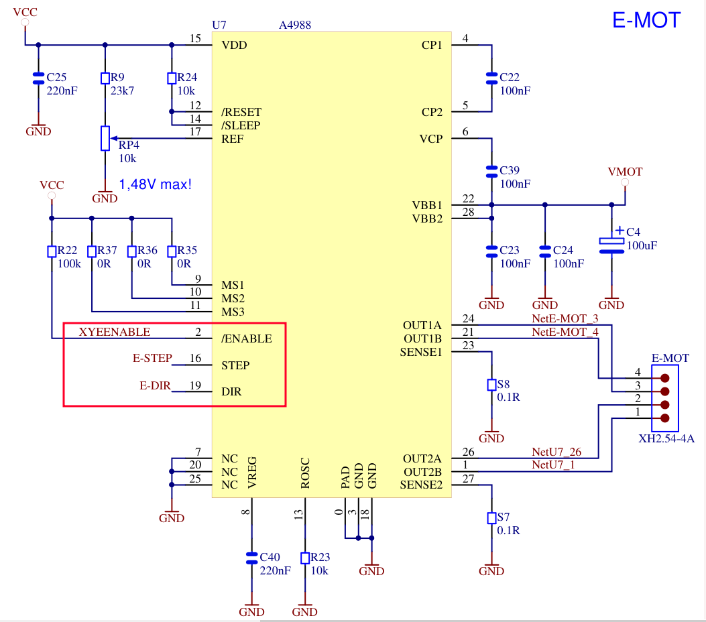
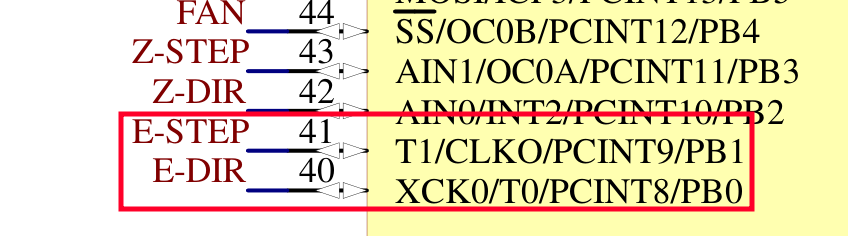
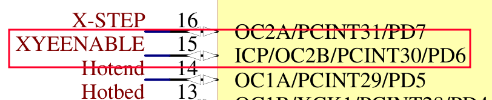

# Reuse Old Ender-3 Boards

It all stared with these two videos:

- CHEP
    - Create Custom Electronics from Ender 3 Boards and Arduino

        <https://www.youtube.com/watch?v=vip3jRc6InM>

    - Controlling Stepper Motors On Older Ender 3 Board

        <https://www.youtube.com/watch?v=1laf2jgdaaM>

- Re-use your 3D printer mainboard and LCD for awesome Arduino projects

    <https://www.youtube.com/watch?v=FJ9al1n0-pY>


## Arduino toolchain needed for Old Enter3 Mother Board

First you would need to install `Sanguino` Toolchain to compile for `ATmega1248` which these boards use:

<https://github.com/Lauszus/Sanguino>


## Schematics and details of Old Enter3 Mother Board

Additionally there is a question of Schematics:

- Melzi 1.1.5 Board <https://github.com/RudolphRiedel/CR-10_wiring/blob/master/Ender3_schematic.PDF>
    - **[PDF Copy](./reuse-old-ender3-boards/Ender3_schematic-v1.1.5.PDF)**
    - Header file for Conversion of Pins to Arduino :
        - <https://github.com/Lauszus/Sanguino/blob/master/variants/sanguino/pins_arduino.h>
        - Just scroll down to the section about `ATmega1248`.

- Another Reference from Marlin Firmware Side
    - <https://github.com/MarlinFirmware/Marlin/blob/2.0.x/Marlin/src/pins/sanguino/pins_MELZI_CREALITY.h>
    - Correlation Code

        ```c
        // ATMEL ATMEGA644/ATMEGA1284 / SANGUINO
        //
        //                        +---\/---+
        //            (D 0) PB0  1|        |40  PA0 (AI 0 / D31)
        //            (D 1) PB1  2|        |39  PA1 (AI 1 / D30)
        //       INT2 (D 2) PB2  3|        |38  PA2 (AI 2 / D29)
        //        PWM (D 3) PB3  4|        |37  PA3 (AI 3 / D28)
        //     SS PWM (D 4) PB4  5|        |36  PA4 (AI 4 / D27)
        //       MOSI (D 5) PB5  6|        |35  PA5 (AI 5 / D26)
        //       MISO (D 6) PB6  7|        |34  PA6 (AI 6 / D25)
        //        SCK (D 7) PB7  8|        |33  PA7 (AI 7 / D24)
        //                  RST  9|        |32  AREF
        //                  VCC 10|        |31  GND
        //                  GND 11|        |30  AVCC
        //                XTAL2 12|        |29  PC7 (D 23)
        //                XTAL1 13|        |28  PC6 (D 22)
        //       RX0 (D 8)  PD0 14|        |27  PC5 (D 21) TDI
        //       TX0 (D 9)  PD1 15|        |26  PC4 (D 20) TDO
        //  INT0 RX1 (D 10) PD2 16|        |25  PC3 (D 19) TMS
        //  INT1 TX1 (D 11) PD3 17|        |24  PC2 (D 18) TCK
        //       PWM (D 12) PD4 18|        |23  PC1 (D 17) SDA
        //       PWM (D 13) PD5 19|        |22  PC0 (D 16) SCL
        //       PWM (D 14) PD6 20|        |21  PD7 (D 15) PWM
        //                        +--------+
        ```

- Datasheet for `ATmega1248` :

    <https://ww1.microchip.com/downloads/en/DeviceDoc/ATmega164A_PA-324A_PA-644A_PA-1284_P_Data-Sheet-40002070B.pdf>

- Simple Stepper Motor control

    Watch the Video by CHEP : <https://www.youtube.com/watch?v=1laf2jgdaaM>

    ??? note "Important Pins of Extruder Motor Driver"

        

    ??? note "The pins of the MCU"

        

        

    We just need to use the `DIR` pin to set Clockwise and Anti-clockwise direction of Rotation.

    The `STEP` pin is used to send pulses to turn the Motor.

    The `/ENABLE` pin enables the respective drivers.

## Firmware for the Old Enter3 Mother Board

- Some useful **Arduino Libraries** to Use with these boards
    - `SpeedyStepper` - Good basic library to test out the onboard stepper motors.

            <https://github.com/Stan-Reifel/SpeedyStepper/>

    -  `U8glib` - The build in support for Graphics LCD for this board. Also used by Marlin Firmware.

            <https://github.com/olikraus/u8glib/>

    - `EncoderStepCounter` - This is used with the Encoder wheel connected on the LCD board.

            <https://github.com/M-Reimer/EncoderStepCounter/>

    - `BOUNCE 2` - Easy to use button press detection and debouncing library.

            <https://github.com/thomasfredericks/Bounce2>

    - `Servo` - Arduino's built in Servo control library

            <https://github.com/arduino-libraries/Servo>


----
<!-- Footer Begins Here -->
## Links

- [Back to Misc. Hub](./README.md)
- [Back to Root Document](../README.md)
